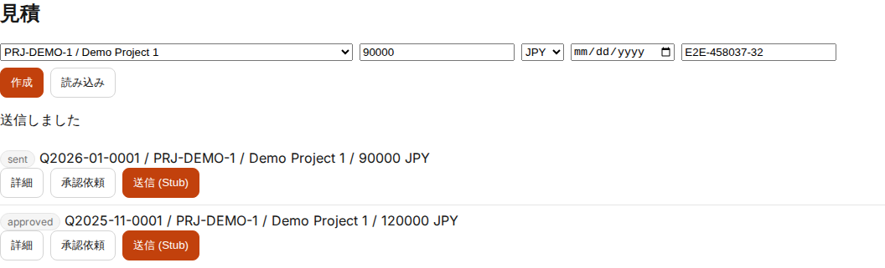
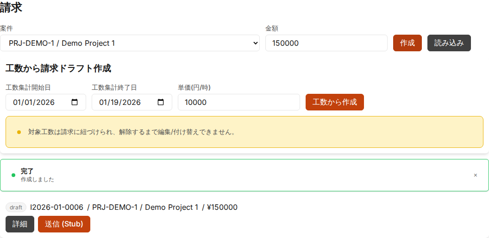
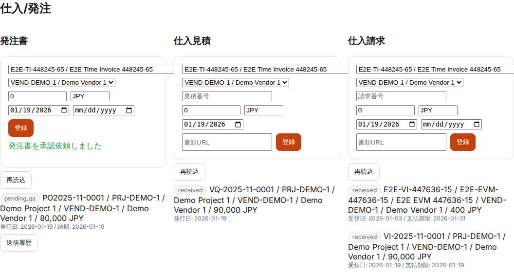
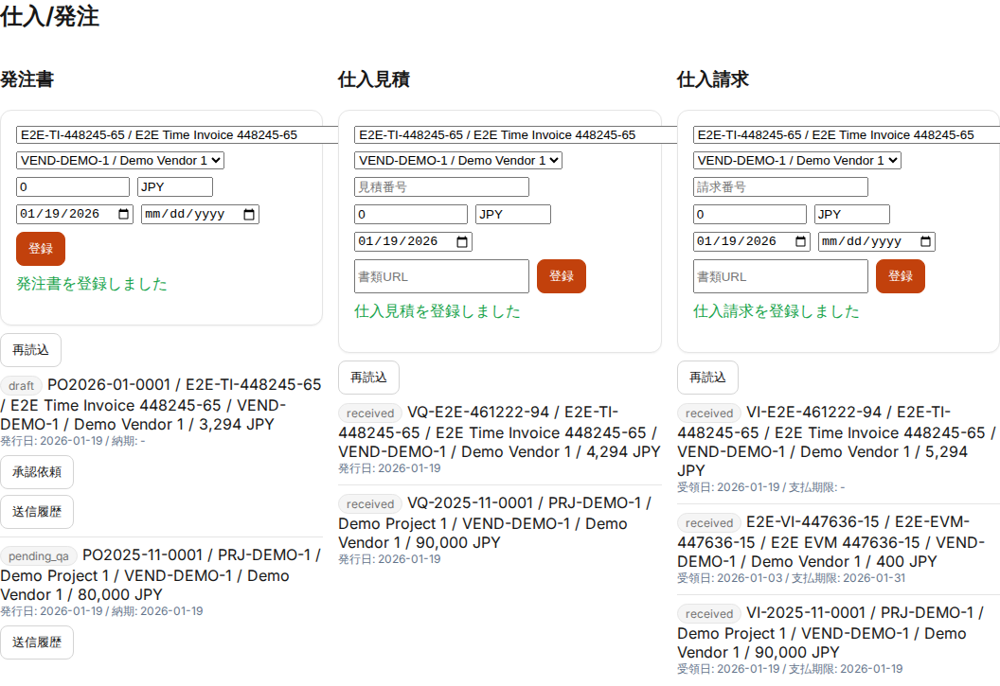
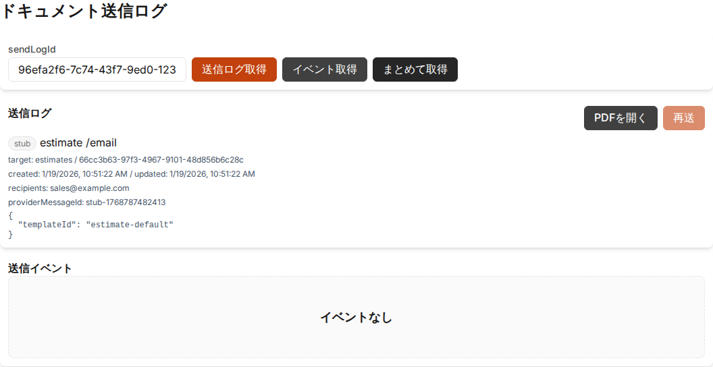
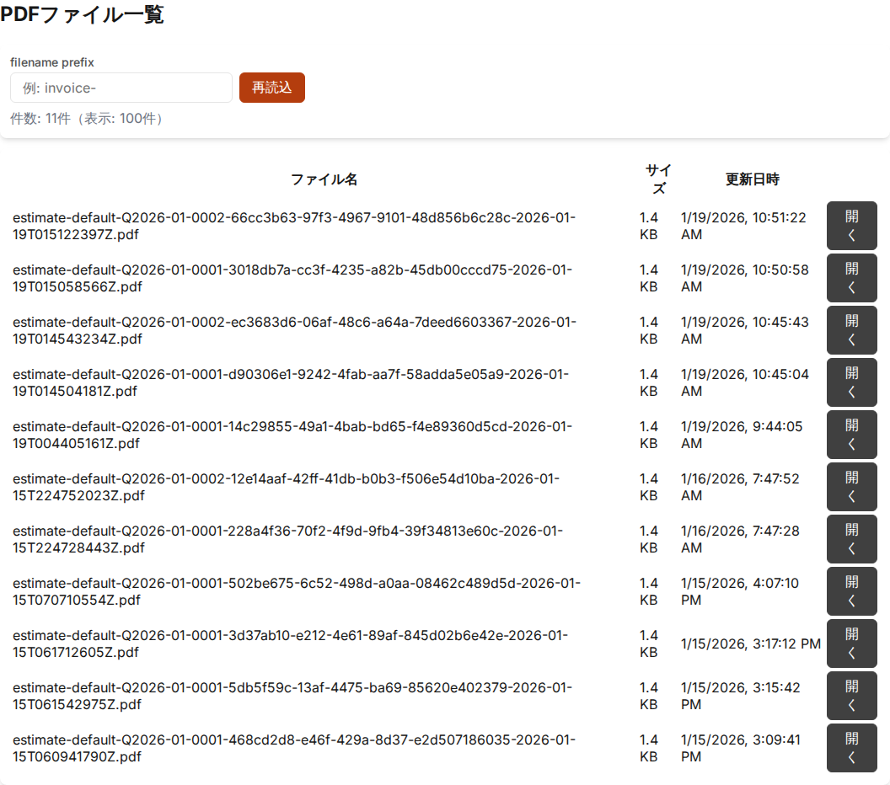

# 見積/請求/発注/仕入 運用ガイド（管理部・経理）

## 目的
- 見積/請求/発注/仕入の入力・承認・送付の運用を標準化する

## 対象読者
- 管理部（`mgmt`）
- 経営（`exec`）
- システム管理者（`admin`）

## 参照
- UI要件（見積/請求/発注/仕入）: [estimate-invoice-po-ui](../requirements/estimate-invoice-po-ui.md)
- 承認/アラート（要件）: [approval-alerts](../requirements/approval-alerts.md)
- PDF/メール（要件）: [pdf-email](../requirements/pdf-email.md)
- UI 操作（管理者）: [ui-manual-admin](ui-manual-admin.md)

## ドキュメント種別
- 見積（Estimate）
- 請求（Invoice）
- 発注書（PurchaseOrder）
- 仕入見積（VendorQuote）
- 仕入請求（VendorInvoice）

## 採番（要点）
詳細は [estimate-invoice-po-ui](../requirements/estimate-invoice-po-ui.md) の「採番ルール」を参照。
- 見積/納品/請求: `PYYYY-MM-NNNN`（P=Q/D/I）
- 仕入関連: `POYYYY-MM-NNNN` / `VQYYYY-MM-NNNN` / `VIYYYY-MM-NNNN`
- 採番タイミング: ドラフト作成時（draftでも番号あり）

## 標準フロー（見積/請求）
1. 起案（draft）
2. 承認依頼（pending_qa）
3. 経営承認（pending_exec、条件によりスキップあり）
4. 承認済（approved）
5. 送信（sent、請求のみ。見積は送信ステータスは簡易）
6. 入金/支払（paid、運用で更新）

注意:
- 見積なし請求は許容（ただし納期（due_date）に基づく未請求チェックを行う）
- 承認後に修正が必要な場合は「取消→修正→再申請」を標準とする

## 標準フロー（発注/仕入）
### 発注書
1. 起案（draft）
2. 承認依頼（pending_qa）
3. 経営承認（pending_exec、条件によりスキップあり）
4. 承認済（approved）
5. 送付（sent）/ 受領確認（acknowledged）

### 仕入見積（VendorQuote）
- 登録・番号付与・金額管理（承認は不要、運用で必要なら後続拡張）

### 仕入請求（VendorInvoice）
1. 受領登録（draft/received）
2. 承認依頼（pending_qa 以降は主要項目ロック）
3. 経営承認（条件によりスキップあり）
4. 承認済（approved）

## 送信/証跡
- 送付は PoC では Stub（または SMTP/SendGrid）を利用
- 送信結果/リトライはドキュメント送信ログに記録される

## よくあるチェック
- 納期超過の未請求（delivery_due）アラートが出ていないか
- 承認遅延（approval_delay/approval_escalation）が出ていないか
- 仕入請求の紐付け漏れ（案件・発注書）がないか

## 関連画面（証跡）

