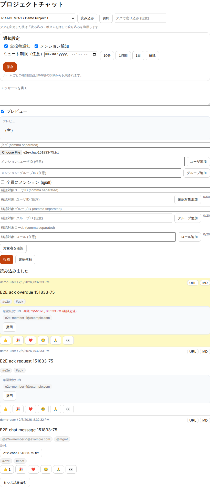
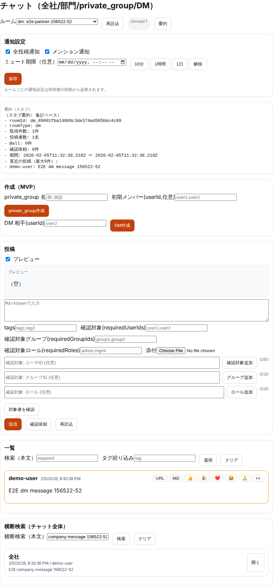

# チャット運用ガイド（MVP）

## 目的

- 会社が認知できる範囲でコミュニケーションを成立させ、監査・説明責任に耐える形にする

## 対象読者

- 利用者（`user`）
- 管理者（`admin/mgmt/exec`）
- 外部ユーザ（ルームACLで制御）

## 参照

- チャット仕様: [project-chat](../requirements/project-chat.md)
- ルーム仕様: [chat-rooms](../requirements/chat-rooms.md)
- 添付（Google Drive）: [chat-attachments-google-drive](../requirements/chat-attachments-google-drive.md)
- 添付（ウイルス対策）: [chat-attachments-antivirus](../requirements/chat-attachments-antivirus.md)
- UI 操作: [ui-manual-user](ui-manual-user.md) / [ui-manual-admin](ui-manual-admin.md)
- UI証跡の再取得: [ui-evidence-quickstart](ui-evidence-quickstart.md)

## ルーム種別（概要）

運用上の扱いは [project-chat](../requirements/project-chat.md) を優先します。

- `project`: 案件ルーム（案件に紐づく）
- `department`: 部門/グループ
- `company`: 全社（必要なら）
- `private_group`: 私的グループ（管理者設定で許可/禁止）
- `dm`: DM（管理者設定で許可/禁止）

## 確認依頼（ack required）

- 重要な周知や合意形成で「確認必須」を設定できます（対象はユーザ/グループ/ロール）。
- 期限（任意）を設定すると期限超過が一覧で可視化されます。
- 詳細な操作手順は [ui-manual-user](ui-manual-user.md) を参照してください。

## ワークフロー向けエビデンス参照（概要）

- 申請画面の注釈（内部参照）から、`エビデンス追加` でチャット発言を検索し、根拠として紐付けできます。
- 候補検索は案件スコープ（同一案件・親子案件）で動作し、必要時は deep link / kind:id の手動追加も可能です。
- 追加した発言は内部リンクとして保持され、申請/承認時に参照できます。
- 注釈画面の `参照状態を確認` で、発言参照の有効性（権限不足/発言削除等）を確認できます。
- 承認画面では `エビデンス（注釈）` から件数・メモ・外部URL・`chat_message` 抜粋を同一画面内で確認できます。

## 通知設定（概要）

- ルームごとに通知設定（全投稿/メンション/ミュート）を変更できます。既定は全投稿です。
- Web通知は通知到達時にミュート（期限付き）を選択できます。
- メール通知は `realtime` / `digest` を選択でき、`digest` は配信間隔（分）を設定します（既定10分）。
- 詳細な操作手順は [ui-manual-user](ui-manual-user.md) を参照してください。

## DM / private_group の統制（MVP）

管理設定（チャット設定）で on/off できます。

- `user/hr の private_group 作成を許可`
- `DM 作成を許可`

## 外部ユーザ（運用上の区分）

- チャットの閲覧/投稿は **ルームACL（viewer/poster）+ メンバーシップ** で制御します（固定ロールでの区分はしません）。
- `allowExternalUsers` は「プロジェクト外ユーザの参加を許可する」ためのフラグとして扱います。
- DM / private_group の可否はチャット設定で制御します。

## 既読/未読・メンション

運用方針（要点）:

- 未読は本人のみ把握できる（他者の未読/既読は表示しない方針）
- メンションは補完選択で対象を指定する
- `ALL` 相当は誤爆防止（投稿前確認 + 回数制限）を併用する

実装状況は PoC のUIに依存するため、差分がある場合は Issue 化して整合させます。

## 添付

### 保存先

- `CHAT_ATTACHMENT_PROVIDER=local`: ローカル保存（検証用）
- `CHAT_ATTACHMENT_PROVIDER=gdrive`: Google Drive（専用アカウント/専用フォルダ）

### セキュリティ運用

- OAuth refresh token は長期鍵として扱い、Secrets 管理/ローテ/失効手順を必須とする
- 監査ログ（upload/download）を確認できること

## 監査閲覧（break-glass）

- 原則: break-glass は監査目的のみ、理由入力 + 監査ログを必須
- 事前に「使用されたことが分かる」仕組みを運用で担保する（ログ/通知/定期棚卸し）

## 関連画面（証跡）

