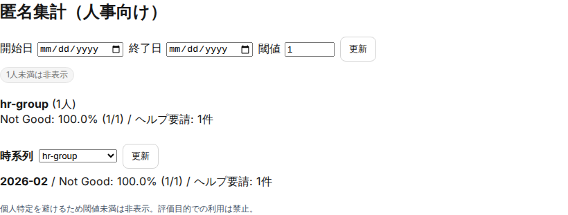

# 人事運用ガイド（ウェルビーイング/HR分析）

## 目的
- ウェルビーイング情報を安全に扱い、必要な支援につなげる

## 対象読者
- 人事（`hr` + 専用グループ）
- 管理者（`admin/mgmt`）

## 参照
- ウェルビーイング入力ポリシー: [wellbeing-policy](../requirements/wellbeing-policy.md)
- 休暇集計/台帳CSV仕様: [leave-hr-reporting](../requirements/leave-hr-reporting.md)
- 権限/可視範囲: [role-permissions](role-permissions.md)
- UI 操作（管理者）: [ui-manual-admin](ui-manual-admin.md)（HR分析/監査ログ）
- UI 操作（利用者）: [ui-manual-user](ui-manual-user.md)（日報+WB）

## 権限（要点）
- 登録: 全ユーザが自分の入力のみ登録できる
- 閲覧: 原則として人事専用（専用グループで制御）
- 監査: 閲覧操作を監査ログに残す（誰が/いつ）

## 運用の基本
- 「評価には使わない」をUI/運用文言で明示し、徹底する
- ヘルプリクエスト（相談したい）が入った場合の一次対応フローを決める
  - 受付 → 対応担当割当 → 対応結果の記録（PoCでは運用で補完）

## 匿名集計
匿名性確保の条件（例: N>=5 など）はポリシーに従う。
実装状況と差分がある場合は Issue として追跡する。

## 休暇集計/台帳CSV（試験運用）
- 対象API:
  - `GET /leave-entitlements/hr-summary`（滞留申請/失効見込み）
  - `GET /leave-entitlements/hr-ledger?format=csv`（付与/取得/失効予定）
- 利用条件:
  - `general_affairs` グループ所属が必須
  - 目的外利用（評価利用/私的利用）を禁止
- 注意点:
  - `hr-summary` の有給失効見込みは `paidGrantUpperBoundMinutes`（上限値）として扱う
  - `hr-ledger` の `expiry_scheduled` は `upper_bound_debit`（上限値）として扱う
  - `hr-ledger` の `from/to` は最大366日
- 出力データの扱い:
  - ローカル保存時は保存先を限定し、共有ドライブへの無制限転送を避ける
  - 運用レビュー後に不要ファイルを削除する

## 関連画面（証跡）

