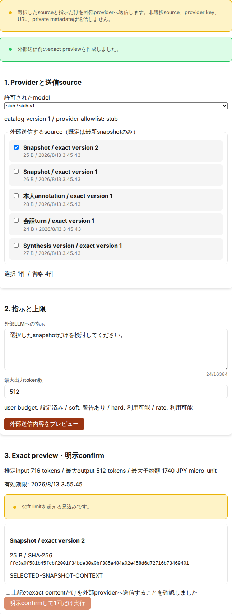
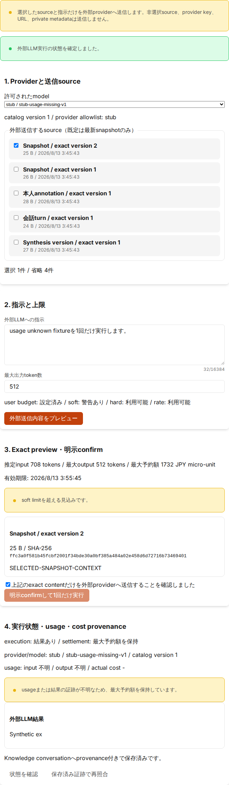

# Knowledge Hub 保存・annotation・会話・Synthesisガイド

## 目的と対象

Knowledge Hub は、外部情報や手動メモを ERP4 の Inbox 項目として登録し、保存時点の内容を改変しない snapshot として版管理する画面です。選択した項目には、本人annotation、取り込んだ会話、versioned Synthesisを別entityとして追加できます。`user` / `admin` / `mgmt` / `exec` ロールの利用者を対象とします。

MVP で扱う入力は次の4種類です。

- 手動テキスト（UTF-8で最大1 MiB）
- 認証情報を含まない HTTP(S) URL
- PDF（最大10 MiB）
- PNG / JPEG / WebP / GIF 画像（最大10 MiB）

ログイン済みページの自動取得、SNS API巡回、source file削除、Google Driveやオブジェクトストレージへの直接リンク提供は行いません。

## ブラウザー共有の共通確認画面

PWA share targetまたはbrowser extensionから受け取ったdraftは、受信しただけでは保存されません。`ブラウザー共有の確認`で次を実施します。

1. ページタイトル、URL、選択テキスト、説明、著者、公開日時のうち保存するfieldだけを選択します。説明、著者等のmetadataは既定で未選択です。
2. 必要に応じてタイトル、URL、選択テキスト、説明、著者、公開日時を修正し、source typeを確認します。URLはcredentialを含まないHTTP(S)だけを使用します。
3. scopeは既定の`personal`を使用します。`organization`を選ぶ場合はgroupを入力し、audienceの追加確認を選択します。
4. `Preview`を選び、backendが正規化した全selected fieldの実値、omitted field名、保存byte数を確認します。field名や件数だけで確定しません。
5. `このexact previewを保存します`を選んでから確定します。

保存結果が`確認中`の場合、同じ内容を再送せず`保存結果を再照合`を使用します。保存開始時にはpreviewで正規化されたexact draft（画面で編集した値を含む）とscope／field選択を端末内へ固定するため、reload後も元の共有値へ戻りません。通常の保存確定では10分を過ぎたpreviewを再利用できませんが、既にpending ledgerが存在する場合は、同じactor、request key、exact payloadへ束縛された署名済みpreviewから新しい保存処理を作らず再照合できます。確認中はInbox、snapshot再照合、annotation／会話／Synthesis等の別mutationとitem／tab切替を停止します。`破棄`はlocal draftを削除する通知を送ります。preview tokenは画面session内だけに保持します。request keyはURLへ露出させず、PWAではTTL付きのlocal IndexedDB、browser extensionでは10分の`chrome.storage.session`に保持します。server確認済みactorへ束縛した後は別actorへ表示・保存・削除させません。いずれもlocalStorage、画面、監査logへ表示しません。

### installed PWAから共有する

1. PWAを一度起動し、onlineで画面が表示されることを確認します。初回起動前などservice workerがまだ有効でない場合は保存済みになりません。起動後に共有操作をやり直してください。
2. OS／browserの共有操作でERP4を選択します。扱うfieldはページタイトル、選択テキスト、HTTP(S) URLだけです。file、画像、PDFはこの経路では共有できません。
3. 未ログインの場合、本文は表示されず端末内に最大60分保持されます。ログインするか、`共有下書きを破棄`を選びます。
4. ログイン後、Knowledge Hubの`ブラウザー共有の確認`で内容を確認します。受信しただけでは保存されません。
5. 保存field、source type、scopeを選択して`Preview`を実行します。scopeは`personal`が既定です。`organization`はgroupと追加確認が必要です。
6. exact previewを確認し、明示確認後に保存します。保存または破棄が確定するとlocal draftは削除されます。端末内削除に失敗した場合はURLを維持したまま削除再試行を表示します。結果不明／pendingでは削除されず、同じ画面からread-only再照合します。

offline中も受信済みdraftは端末内に保持されますが、自動送信されません。offlineへ移行すると表示中の本文とpreviewを消去し、online復帰時にserver sessionを再確認してから利用者がpreviewを実行します。queueは10件までで、上限時に古いdraftを自動削除しません。各共有gestureは別draft／request keyです。同じlandingの再読込や結果不明後の再照合だけが、URLに出ない保存済みrequest keyでserver-side idempotencyへ収束します。未認証で受信したdraftは、最初にserver確認されたERP4利用者へ端末内で束縛されます。claim前はERP4 accountではなくbrowser profileがlocal trust boundaryであるため、共有端末では意図した利用者で最初にログインするか、内容を受け取らず破棄してください。claim後のログアウトまたは別tabでのaccount切替はactor情報を含まないsession-generation通知で表示中の本文とpreviewを即時消去します。previewの前後と保存／再照合の直前にもserver actorを再確認し、claim済みdraftは別利用者へ表示・保存・削除させません。TTL 60分を過ぎた内容は表示中でも消去され、browserが動作している次のcleanup機会に物理削除されます。本文を含むURLをbookmark／共有する機能はありません。共有下書きを端末に残したくない場合は、同じ利用者でログインした状態から明示的に破棄してください。

意図しない共有下書きが表示された場合は、previewや保存を行わず破棄してください。browser互換のため、service workerからinitiator metadataを取得できないPOSTも端末内stagingまでは受理しますが、ERP4 APIのmutation、自動保存、cookie/session読取は行いません。保存には認証済み画面でのexact previewと明示confirmが必要です。

PWA share targetをrollbackする場合は、先にfrontend build envを`VITE_PWA_SHARE_TARGET_MODE=decommission`としてbuild／配布します。このbridge releaseはmanifestから新規受付を外し、service workerのPOST受付を停止しつつTTL／discard cleanupを維持します。利用者へ残存draftの破棄またはERP4 originのsite data削除を案内し、最大60分のTTLとclient activationを確認してから旧service workerへ戻してください。`sw.js`、`share-target-sw.js`、`share-target-mode.js`は`Cache-Control: no-cache`で再検証されます。旧imageへ即時に戻すだけでは、旧codeが専用IndexedDBを認識せずlocal本文が残る可能性があります。

### Chrome／Edge拡張から共有する

拡張のbuild、unpacked install、browser別の確認、rollbackは[Browser Capture拡張運用](browser-capture-extension.md)を参照してください。

1. 共有元ページで必要な文字列だけを選択し、ERP4 Browser Captureのactionを明示的に選びます。拡張はaction操作なしにpageを読みません。
2. popupでtitle、URL、選択文字列、allowlist metadata、送信／省略field、destination originを確認します。password/form値、DOM HTML、cookie、browser historyは取得されません。
3. `ERP4で確認`を選びます。draft本文ではなくopaque IDだけを持つERP4画面が開きます。この時点ではKnowledgeへ保存されません。
4. ERP4へログインし、`Browser Capture下書き`とKnowledge Hubの`ブラウザー共有の確認`を確認します。別accountへ切り替えた場合は旧actorの内容が画面から消去されます。
5. 保存field、source type、scopeを選び、exact previewを確認してから明示確定します。scopeはpersonalが既定で、organizationはgroupと追加確認が必要です。

ERP4を開けない場合、draftは同じbrowser sessionの拡張storageから10分間だけ読取可能です。期限後はreadを拒否し、次のextension実行またはbrowser session終了時にrecordを物理削除します。自動送信されないため、online／login状態を確認してpopupから再度`ERP4で確認`を選びます。browser sessionを終了するとdraftは失われる場合があります。結果不明時に新しい保存操作を繰り返さず、ERP4画面のread-only再照合を使用してください。確定または破棄後はsession draftを削除します。rollbackは拡張をdisable／uninstallし、ERP4 cookie、session、既存Knowledgeは削除しません。

## 新しい Inbox 項目へ保存する

1. 左メニューの `ナレッジ` から `Knowledge Hub` を開きます。
2. `保存先` は既定の `新しいInbox項目` を選択します。
3. `保存形式` を選択します。
4. `scope` を確認します。通常は既定の `personal（個人）` を使用します。
5. 必要に応じてタイトルを入力し、本文、URL、PDF、画像のいずれかを指定します。
6. `Inboxへ保存` を選択します。
7. `保存済み`、version、content type、size、取得日時、SHA-256を確認します。


## 既存項目へ version を追加する

1. `Knowledge Inbox` から対象項目を選択します。
2. `保存先` を `選択中の項目へversion追加` に変更します。
3. 保存形式と内容を指定します。
4. `新しいversionを保存` を選択します。
5. version 履歴に新しい版が追加され、以前の版が更新されていないことを確認します。

確定済み snapshot は画面から上書きしません。内容を訂正する場合も、新しい version として追加します。

## scope と共有範囲

### personal

- 既定値です。
- 通常の UI / API では owner だけが参照できます。
- 会社の運用者、監査、バックアップから独立した私物保管領域ではありません。

### organization

- `共有先グループID` を1件以上入力します。
- 保存前に `組織の共有範囲へ保存することを確認しました` を明示的に選択します。
- role 名だけでは閲覧範囲を拡張せず、対象組織と有効な group grant によって認可されます。
- 保存先が organization の既存項目である場合も、version 追加ごとに確認が必要です。

誤った共有範囲を指定した場合、画面上で scope を変更して再保存するのではなく、組織の運用手順に従って対象項目を確認してください。

## 本人annotationを追加・改訂する

1. `Knowledge Inbox` から対象項目を選択します。
2. `Annotation / 会話 / Synthesis` の `本人annotation` tabを開きます。
3. 種類（本人メモ、質問、仮説、引用、TODO）とorigin（本人、外部情報、AI、System、Tool）を選択します。
4. 本文を入力し、`アノテーションを作成` を選択します。
5. 訂正する場合は対象annotationの`改訂`を選びます。旧本文はrevision履歴に残り、上書き消去されません。
6. 不要になった場合は`削除`を選びます。論理削除のため、再読込後も削除済みであることと履歴を確認できます。

annotation本文は元snapshotへ連結されません。種類とoriginは色だけでなくtext labelでも表示されます。organization項目でも、current item ACLをserver側で再検査します。作成・改訂・削除はitem ownerだけが実行でき、共有先の非ownerにはannotation管理可否APIのserver判定に基づく「閲覧のみ」を表示します。管理可否を取得できない場合も安全側で閲覧専用とし、annotation一覧とrevision履歴の参照は維持します。一覧またはrevision履歴に続きがある場合は`さらに読み込む`操作が表示され、opaque cursorで次ページを取得します。

## 会話をpreviewして取り込む

`会話・取込` tabでは、次の3形式を一件の`KnowledgeConversation`として取り込みます。

- 手動入力: タイトル、role、origin、1 turnの本文を画面で入力する
- JSON: strictな`title`、`provider`、`model`、`turns[]`構造を入力する
- Markdown: 次のversion付き限定文法を入力する

```markdown
# Knowledge Conversation v1

title: 検証会話
provider: other
model: other

## Turn

role: user
origin: user

確認したい内容

## Turn

role: assistant
origin: ai

回答本文
```

Markdownの見出しや引用記号からspeakerを推測しません。raw HTML、script、linkを実行・取得せず、本文はtextとして表示します。

1. 形式と内容を指定し、`取込内容をプレビュー`を選択します。
2. title、turn数、role、origin、関連item数、有効期限を確認します。この時点ではDBへ会話を保存しません。
3. 内容を変更した場合は以前のpreviewを使用せず、もう一度previewします。
4. `取込を確定`を明示的に選択します。
5. 同じoperationを再送した場合は`再利用`と表示され、conversationやturnを増殖させません。

上限はraw/canonical各512 KiB、1 turn 64 KiB、turn 200件、linked item 20件、JSON depth 12/node 5,000、Markdown 5,000行です。preview tokenは10分間だけcomponent memoryへ保持し、request keyとともに画面・log・永続storageへ表示・保存しません。

取り込み後のtimelineでは`User`、`AI Assistant`、`System`、`Tool` roleと、本人・外部情報・AI・System・Tool originを別labelで確認できます。provider/modelは固定語彙だけを表示し、provider URL/keyは表示しません。関連会話またはtimelineに続きがある場合は`さらに読み込む`操作で次ページを取得できます。

## Synthesisを作成・version追加する

1. `Synthesis・結論` tabを開きます。
2. タイトル、結論、confidence、未解決事項を入力します。
3. `統合知を作成`を選択します。選択中のKnowledge itemが`主根拠`として明示的に関連付けられます。
4. 結論を更新するときは新しいversionを追加し、version履歴を確認します。

confidenceは0〜100%で入力し、未設定と0%を区別します。未解決事項は結論と分離して表示されます。sourceへのcurrent accessが失効した場合、非公開本文や識別子を展開せず`参照不可（redacted）`として表示します。Synthesis scopeは選択中itemと同じ値に固定され、画面操作だけでpersonalからorganizationへ昇格しません。

Synthesis一覧はcurrent actorが参照可能なglobal一覧です。選択中itemをcurrent versionのaccessibleなitem sourceとして持たないSynthesis、またはcurrent sourceの一部が参照不可のSynthesisは参照専用となり、不完全なprovenanceでversionを置き換える操作はできません。version追加時はcurrent sourceの種類・関係・順序を維持します。一覧またはversion履歴に続きがある場合は`さらに読み込む`操作で次ページを取得します。

## Chatへ必要なfieldだけを共有する

`Chatへ共有` tabでは、元Knowledge itemの閲覧権限を移譲せず、選択したfieldだけをimmutable cardとしてChat roomへ共有します。

1. `Knowledge Inbox`から対象itemを選択し、`Chatへ共有` tabを開きます。panel見出しは`Chatへ選択共有`です。
2. 共有先Chat roomを選択します。外部参加者を許可するroomはMVPではfail closedです。
3. 共有するfieldを個別に選択します。初期状態で選択されるのはタイトルだけです。
4. 必要な場合だけ、ready snapshotのversion／SHA-256／抜粋、active label assignment、current annotation revision、conversation turn、current Synthesis version、共有者メモを選択します。
5. `共有内容をプレビュー`を選択し、保存されるcard、共有先、省略カテゴリ、有効期限を確認します。この時点ではChatへ投稿されません。
6. `上記の共有先と共有内容が完全に一致することを確認しました`を明示的に選択し、`確認した内容をChatへ共有`を実行します。

private label、annotation、AI／System／Tool turn、Synthesis、snapshot全文、URLは既定で未選択です。非選択fieldはcardで隠すだけではなく、share snapshotへ保存しません。preview後に元version、選択field、ACL、room post権限が変わった場合は確定せず、再previewが必要です。preview tokenとrequest keyはcomponent memoryだけに保持し、localStorage、画面、logへ表示しません。

Chat共有またはナレッジ化の確定中は、結果と同じ操作識別子を保持するため、Knowledge item、tab、Chat room、thread、ERP4内の別画面へ移動できません。deep linkと再読込も実行せず、確定結果が表示されてから次の操作へ進みます。ブラウザの再読込・終了時は離脱警告を確認してください。

共有結果が`投稿確認中`の場合、同じ投稿を自動再送せず、`既存投稿を読取専用で照合`を実行します。照合は既存Chat messageとの対応だけを確認し、新しいmessageを作りません。`投稿失敗`は自動retryせず、新しいpreviewから明示的にやり直します。同じrequest keyと同じ内容は既存shareを再利用し、内容が異なる場合は競合として確定しません。

`共有を取り消す`と、Chat rootとreply履歴は監査のため残り、cardは内容を含まない取消placeholderになります。元itemの論理削除やACL変更だけでは、共有時に許可されたcard snapshotは自動的に書き換わりません。

## 共有スレッドの選択返信をSynthesisへ昇格する

Knowledge share cardのthreadでは、選択したactive direct replyだけを新しいKnowledge Synthesisへ明示的にpromoteできます。自動要約やthread全文の暗黙コピーは行いません。

1. Room ChatでKnowledge share cardの`スレッドを開く`を選択します。
2. `選択した返信をナレッジへ`を開きます。返信は初期状態で1件も選択されません。
3. 必要な返信だけを選び、選択順を確認します。削除済みreplyや別threadのmessageは対象外です。
4. 保存先scopeを確認します。既定はpersonalです。organizationを選ぶ場合はgroup accountを指定し、追加のaudience確認が必要です。
5. Synthesisのタイトル、結論、任意のconfidence、未解決事項を入力します。
6. previewでselected／omitted件数、exact reply本文、保存先scopeを確認し、明示confirm後に1回だけ確定します。

promote後のSynthesis本文とimmutable selected-message snapshotはdestination Knowledge ACLで保持されます。後からroom accessが失効した場合、live Chat identityやsource provenanceはredactされますが、room accessをKnowledge write権限へ昇格させることはありません。

## 外部LLMへ選択したcontextだけを送信する

`外部LLM対話` tabは管理者がKnowledge専用provider、model catalog、利用者予算を明示設定した場合だけ利用できます。既定は無効であり、Chat要約の設定やcredentialへfallbackしません。

1. 対象itemを選択し、`外部LLM対話` tabを開きます。
2. allowlistされたmodelを確認します。利用者が任意provider／modelを入力することはできません。
3. 外部送信するsourceを選択します。既定選択は最新のready snapshotだけです。annotation revision、user／assistant conversation turn、Synthesis versionは必要なものだけを追加します。System／Tool turnはこのMVPでは候補APIの段階で除外され、画面にも表示されません。
4. 指示と最大出力token数を入力し、`外部送信内容をプレビュー`を選択します。この時点ではprovider requestも予算予約も作成されません。
5. exact source本文、version／SHA-256、選択／省略件数、推定input token、最大予約額、soft／hard／rate状態を確認します。
6. `上記のexact contentだけを外部providerへ送信することを確認しました`を明示的に選択し、`明示confirmして1回だけ実行`します。

実行中、commitの送信段階を確定できない間、およびrunが`reserved`／`dispatched`の間は、同じintentとrequest keyを保護するためKnowledge item／tab切替とInbox更新が無効になります。preview tokenとrequest keyは現在のcomponent memoryだけに保持され、localStorage、URL、画面へ保存されません。commit前またはterminal runの表示中にitem／tabを切り替えた場合は、previewと表示中のprovider結果を破棄します。`result_ready`／`failed`／`result_unknown`へ到達するまでは、同じrunの状態確認だけを使用してください。

| 表示状態                                              | 意味                                             | 操作                                                                                                                                          |
| ----------------------------------------------------- | ------------------------------------------------ | --------------------------------------------------------------------------------------------------------------------------------------------- |
| `結果確定 / 実績精算済み`                             | 有効な本文とusageを保存し、actual costを精算済み | provenanceとKnowledge conversation保存を確認する                                                                                              |
| `結果確定 / 最大予約額を保持`                         | 本文は保存されたがusage証跡が欠落または不正      | 自動再送せず、運用証跡がある場合だけ再照合する                                                                                                |
| `結果不明 / 最大予約額を保持`                         | dispatch後の結果を安全に確定できない             | `保存済み証跡で再照合`だけを実行する。再送はしない                                                                                            |
| `予算予約済み`または`送信済み・結果確認中` / `予約中` | grace期間中またはlocal finalizationが未完了      | grace期間後に`保存済み証跡で再照合`を実行する。providerへ再送せず、未dispatchなら予約を解放し、dispatch済みで結果不明なら最大予約額を保持する |
| hard／rate block                                      | provider dispatch前に予算またはrate guardで拒否  | 管理者にpolicyを確認し、新しいpreviewから再判断する                                                                                           |

`保存済み証跡で再照合`はprovider requestを再送しません。grace期間中または新しい保存済みoutcomeがない場合は「状態は変更されませんでした」と表示し、現在の予約／最大予約額保持を維持します。同じ操作をやり直す場合も自動retryや別provider fallbackは行わず、新しいpreviewと明示confirmが必要です。API key、base URL、provider raw error、source internal IDはUIへ表示しません。

commit応答をnetwork errorで確認できない場合、または403／404等で送信前の拒否と送信後のACL失効を区別できない場合は、`状態を確認`だけを使用します。直後に「実行の作成状態をまだ確認できません」と表示されても、新しいpreview、別request key、別item／tabへの切替はできません。同じrunの状態確認を再度行うか、運用担当が保存済みrun／予算予約を確認してください。これは元のcommitが遅れて成立した場合の二重provider dispatchを防ぐためです。

`preview_token_expired`、`stale_preview`、hard／rate block、policy不一致、providerの明示的な送信前拒否など、server error codeがprovider未送信を保証する場合だけintent lockを解除します。その場合は表示された原因を解消し、新しいpreviewから再確認します。HTTP statusだけを根拠に未送信と判断しません。






## 保存状態と再照合

| 状態       | 意味                                      | 操作                                                              |
| ---------- | ----------------------------------------- | ----------------------------------------------------------------- |
| `確認中`   | 外部保存結果が確定していない              | 同じブラウザ session に表示される `保存結果を再照合` を実行する   |
| `保存済み` | immutable snapshot と checksum が確定した | provenance を確認し、必要なら認可済み download を実行する         |
| `失敗`     | 検証または保存が確定的に失敗した          | 画面のsanitized案内に従い、入力を確認して新しい操作として保存する |

保存処理の結果が不明な場合、画面は Inbox 項目を保持し、同じ外部 create を自動再送しません。再照合用 request key は現在のブラウザ session 内だけに保持され、画面や log には表示されません。再読込後に再照合ボタンがない場合は、自動再送せず運用担当へ確認してください。

## 認可済み download

- `保存済み` の snapshot だけに download ボタンが表示されます。
- download の直前に ERP4 が item / snapshot / artifact owner の認可と状態を再確認します。
- provider URL、provider key、直接共有権限は利用者へ返しません。
- HTML等の active content を画面内で実行せず、download response は attachment として扱います。

## 入力エラーと安全上の注意

- URL は `http://` または `https://` で始まり、username/passwordを含まないものを指定します。
- server側では redirect、private/loopback address、timeout、content type、宣言sizeと実測sizeを再検証します。
- browser側のファイル拡張子やMIME確認だけを安全性の根拠にしません。
- error response の生本文、provider識別子、secret様値は画面に表示しません。
- 実credential、個人情報、顧客機密をテストや画面証跡へ入力しないでください。

## 関連文書

- [Knowledge Hub 基盤要件](../requirements/knowledge-hub.md)
- [Knowledge Hub 境界 ADR](../architecture/knowledge-hub-boundary.md)
- [Issue #2012 UI/E2E 検証結果](../test-results/2026-08-06-issue2012-knowledge-snapshot-ui.md)
- [Issue #2013 annotation／会話／Synthesis UI検証結果](../test-results/2026-08-08-issue2013-knowledge-provenance-ui.md)
- [Issue #2015 選択共有／Chat card／promote UI検証結果](../test-results/2026-08-10-issue2015-knowledge-share-promote-ui.md)
- [Issue #2016 外部LLM selected-context／budget UI検証結果](../test-results/2026-08-13-issue2016-knowledge-llm-ui.md)
