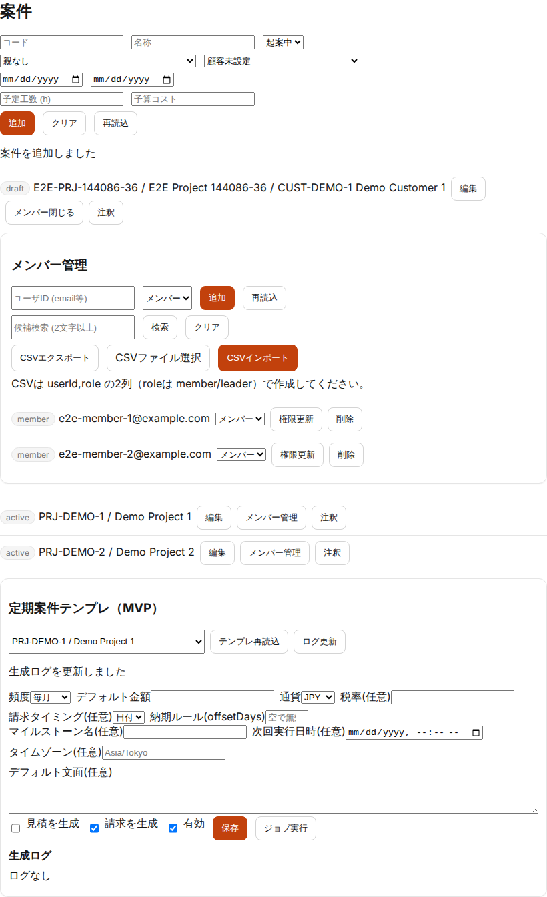
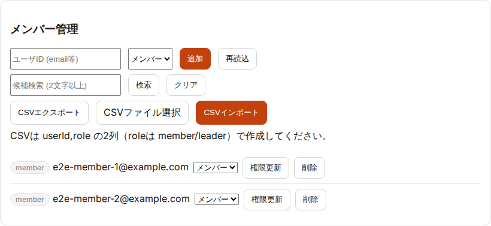
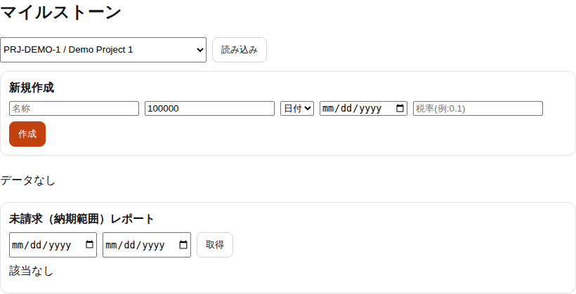

# 案件リーダー運用ガイド（PoC）

## 目的
- 案件リーダーが「案件の進行」と「入力の整合」を維持できるようにする

## 対象読者
- 案件リーダー（ProjectMember: `leader`）
- 管理者（`admin/mgmt`）

## 参照
- 案件メンバー運用（要件）: [project-member-ops](../requirements/project-member-ops.md)
- タスク/マイルストーン/請求連動（要件）: [project-task-milestone-flow](../requirements/project-task-milestone-flow.md)
- UI 操作（管理者）: [ui-manual-admin](ui-manual-admin.md)
- UI 操作（利用者）: [ui-manual-user](ui-manual-user.md)

## 権限の前提（現状）
- 案件の作成/リーダー付与: `admin/mgmt`
- リーダー付与後のメンバー追加/削除: 管理者に加え、案件リーダーが実施可能（PoC）

## 運用の基本
### 1. 案件を作る（管理者）
- 案件コード/案件名/状態を設定し、必要なら顧客を紐付ける
- リーダー（ProjectMemberRole=leader）を登録する

### 2. メンバーを維持する（リーダー）
- 参画開始/終了に合わせてメンバーを追加/削除する
- 付け替え（工数/経費/タスク）を行う前に、対象案件のメンバーを整備する

### 3. タスクを運用する（リーダー/利用者）
- 最小: タスクを作成し、工数入力でタスクを選択できる状態にする
- 進捗/完了の粒度は、請求/マイルストーン運用に影響するため、案件内でルールを統一する

### 4. マイルストーンと請求の整合を取る（リーダー/管理者）
- マイルストーンは任意だが、納期超過の未請求はアラート対象（運用上の抜け漏れ防止）
- 金額/納期の変更は、請求ドラフトとの整合に影響するため、変更後に請求側を確認する

## チェックポイント（推奨）
- 週次: メンバー・タスクの棚卸し、未入力/未請求の確認
- 月次: 工数/経費の集計、締め対象の確認（期間締めを運用する場合）

## 監査/ログ
- 付け替え（project/task reassignment）は監査対象（理由入力を前提）
- 監査ログの確認は [ui-manual-admin](ui-manual-admin.md) の「監査ログ」を参照

## 関連画面（証跡）

