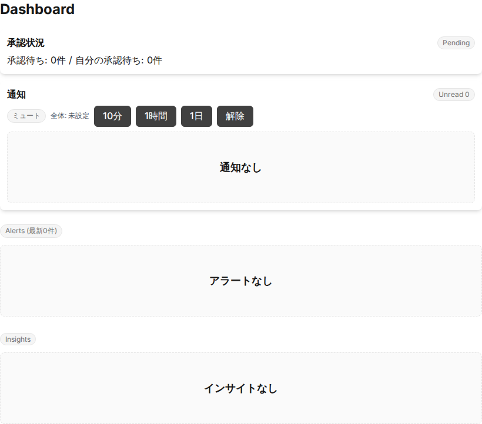
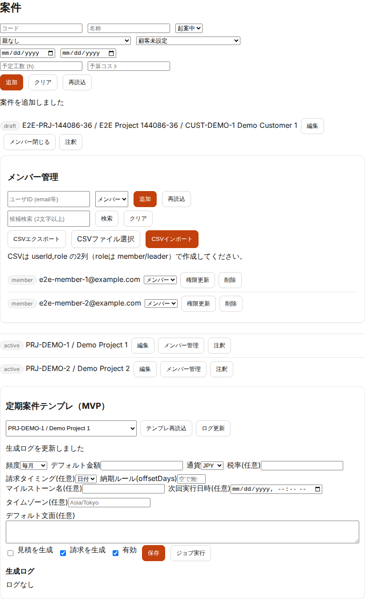
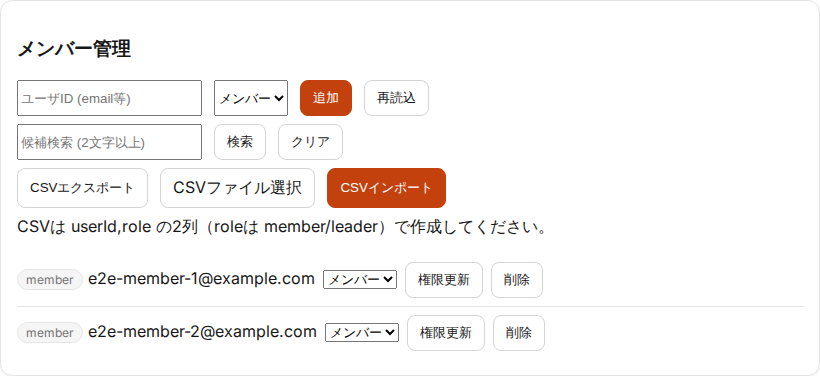
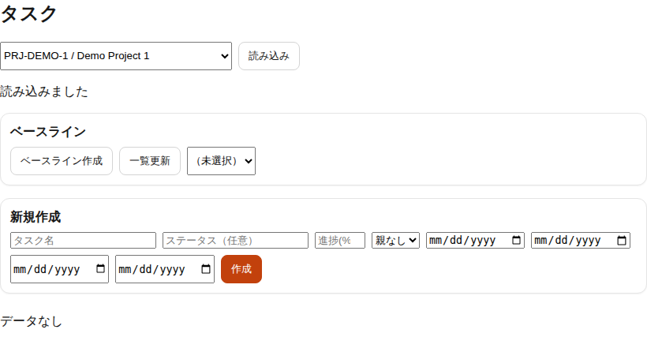
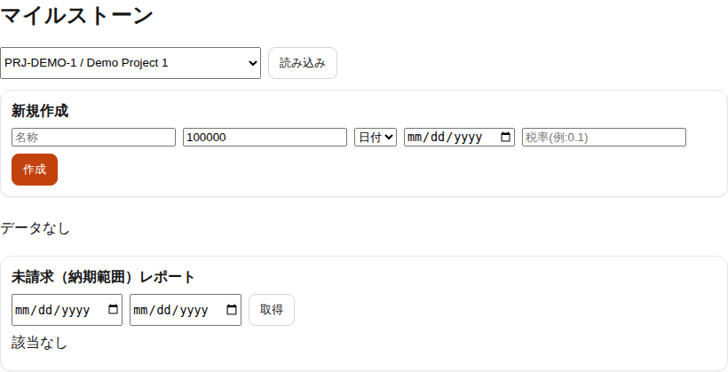
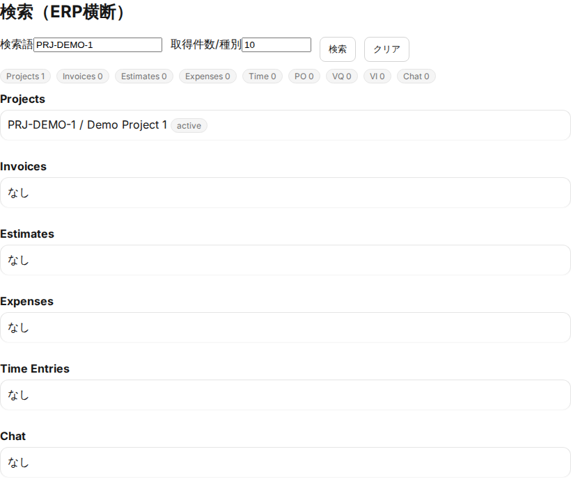

# ERP4 案件リーダーチュートリアル（画面キャプチャ付き）

更新日: 2026-02-25

## 目的

案件リーダー（`leader`）が、案件運用で頻出する操作を短時間で確認するためのチュートリアルです。

## 前提

- 対象: `leader`（一部操作は `admin` / `mgmt` 権限が必要）
- 所要時間: 15〜25分
- 画面キャプチャ: `docs/test-results/2026-02-05-frontend-e2e-r1/`
- 詳細仕様は `docs/manual/project-leader-guide.md` と `docs/manual/ui-manual-user.md` を参照

## チュートリアル（Step by Step）

### Step 1: ダッシュボードで承認・通知を確認する

1. 「ダッシュボード」を開く  
2. 承認状況・通知・Alerts を確認する  
3. 必要な通知を既読化する

完了条件:
- 当日対応が必要な事項（承認待ち/アラート）を把握できる

### Step 2: 案件情報を確認する

1. 「プロジェクト」を開く  
2. 担当案件を検索し、期間・状態・予算・予定工数を確認する  
3. 必要に応じて `メンバー管理` を開く

完了条件:
- 担当案件の基本情報を確認できる

### Step 3: メンバーを更新する

1. 「メンバー管理」で対象案件を開く  
2. `候補検索` からユーザーを選択して追加する  
3. 必要に応じて権限更新/削除を実行する

完了条件:
- 案件メンバー構成を更新できる

### Step 4: タスクを管理する

1. 「タスク」を開く  
2. タスク名・担当者・期限を入力して登録する  
3. 進捗に応じてステータスを更新する

完了条件:
- 工数入力で選択できるタスクを管理できる

### Step 5: マイルストーンを確認する

1. 「マイルストーン」を開く  
2. 未請求のマイルストーンと納期を確認する  
3. 必要に応じて名称・金額・納期を更新する

完了条件:
- 納期超過や請求漏れに繋がる項目を把握できる

### Step 6: 横断検索で影響範囲を確認する

1. 「検索」で案件名またはコードを入力する  
2. 見積/請求/工数/経費/チャットの結果を確認する  
3. 必要なら対象画面へ遷移して修正する

完了条件:
- 案件変更の影響範囲を横断的に確認できる

## 次の参照先

- 案件リーダー運用ガイド: `docs/manual/project-leader-guide.md`
- 利用者向け詳細操作: `docs/manual/ui-manual-user.md`
- 管理者向け詳細操作: `docs/manual/ui-manual-admin.md`
