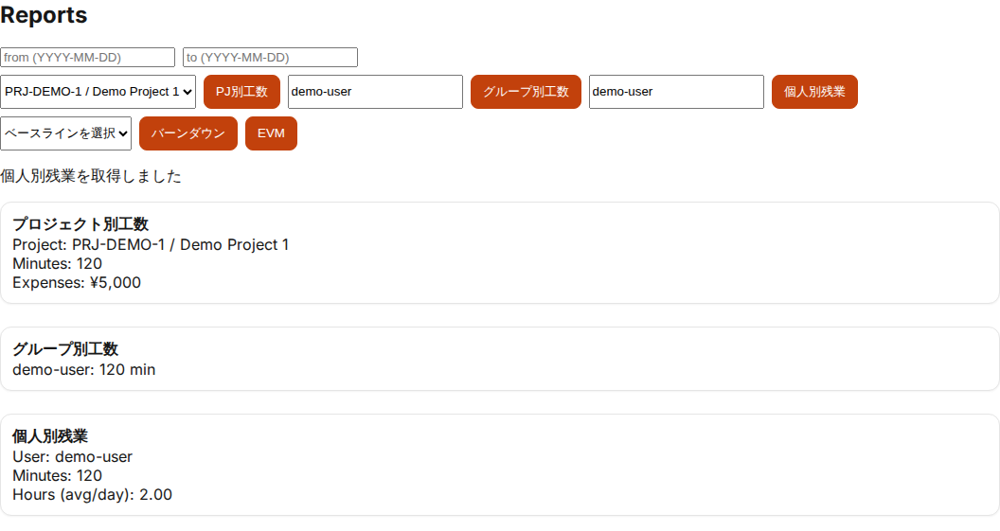

# レポート/アラート運用ガイド（PoC）

## 目的
- 工数/予実/残業の把握と、逸脱（予算超過・残業増・承認遅延）の検知を標準化する

## 対象読者
- 管理者（`admin/mgmt/exec`）
- 案件リーダー（必要に応じて閲覧）

## 参照
- レポート拡張（要件）: [workflow-report-expansion](../requirements/workflow-report-expansion.md)
- アラート（要件）: [approval-alerts](../requirements/approval-alerts.md)
- UI 操作（管理者）: [ui-manual-admin](ui-manual-admin.md)（レポート/管理設定/ダッシュボード）

## 現状の主要レポート（UI: Reports）
- プロジェクト別工数（from/to 指定）
- グループ別工数（userIds 指定 + from/to）
- 個人別残業（userId 指定 + from/to）
- バーンダウン（baselineId + from/to）
- EVM（from/to）

注意:
- from/to は `YYYY-MM-DD` 形式で入力する（UI/Api仕様に合わせる）

## ダッシュボード（インサイト/アラート）
運用上の位置づけ:
- **レポート**: 分析・説明のための集計（期間指定で確認）
- **アラート/インサイト**: 逸脱の早期検知（対応のトリガ）

## アラート設定（管理設定）
設定項目（最小）:
- type（budget_overrun/overtime/approval_delay/…）
- threshold / period
- recipients（roles/users/emails）
- channels（dashboard/email など）

推奨運用:
- まずは dashboard + メール（一次対応者）に限定し、通知過多を避ける
- 閾値変更は Issue に理由を残す

## 関連画面（証跡）

