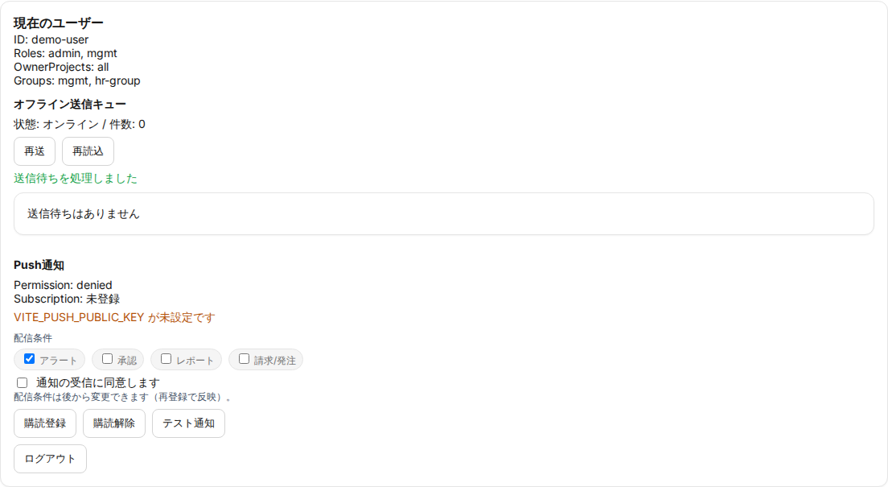
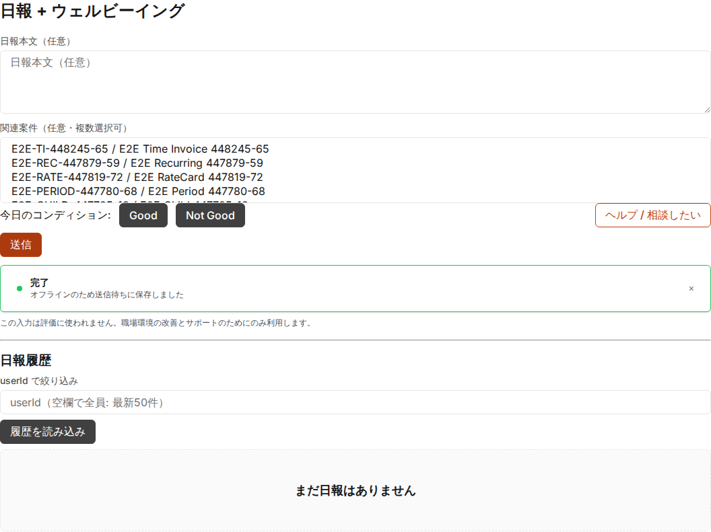

# 初回利用・共通操作ガイド（利用者/管理者）

## 目的
- 初回の導入コストを下げ、誤操作/問い合わせを減らす

## 対象読者
- 利用者（`user`）
- 管理者（`admin/mgmt/exec/hr`）

## 前提
- PoC では擬似ログイン（UI上で userId/roles を入力）を利用可能
- 本番では Google OIDC を前提（詳細: [auth-architecture](../requirements/auth-architecture.md)）

## 初回に行うこと（共通）
1. ログイン状態の確認（現在のユーザー）
2. ダッシュボードの確認（承認/通知/アラート）
3. ERP横断検索の確認（案件/見積/請求/工数/経費/チャット）
4. オフライン送信キューの挙動を確認（再送/破棄）
5. Push通知（任意）の購読登録（PoC/検証の範囲）

## 画面キャプチャ（証跡）
PoC の E2E 実行時に取得した画面キャプチャです。

詳細手順（画面操作）:
- 利用者: [ui-manual-user](ui-manual-user.md)
- 管理者: [ui-manual-admin](ui-manual-admin.md)

## よくある運用ルール（推奨）
- 「案件に紐づく入力」は必ず案件を選択して登録する（共通経費は専用案件で運用）
- Not Good（ウェルビーイング）は評価に使わない（運用文言を徹底）
- 送信/承認の遅延はアラートで検知し、Issue/チケットで追跡する

## 問題がある場合
- 403（権限不足）: [role-permissions](role-permissions.md) を参照し、ロール/案件/グループを確認する
- 送信失敗/表示崩れ: [troubleshooting](troubleshooting.md) を参照する
