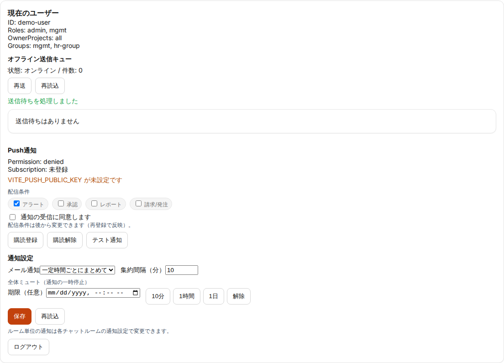
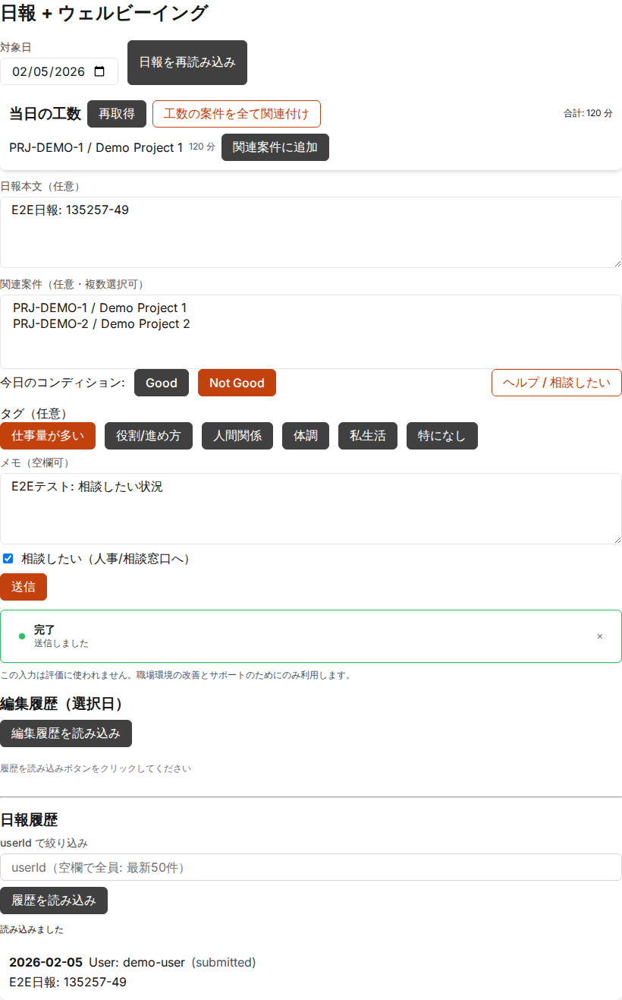
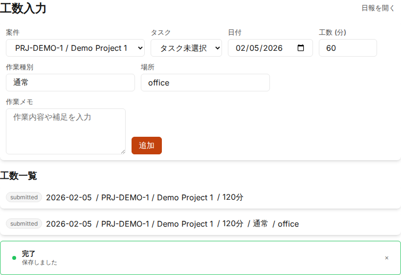
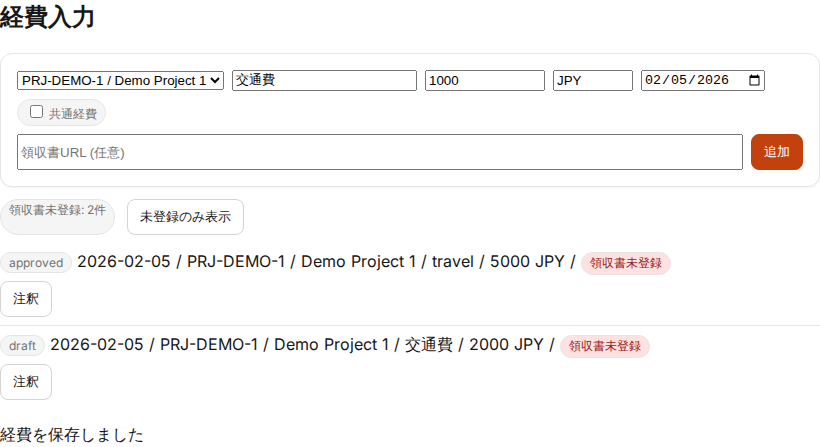
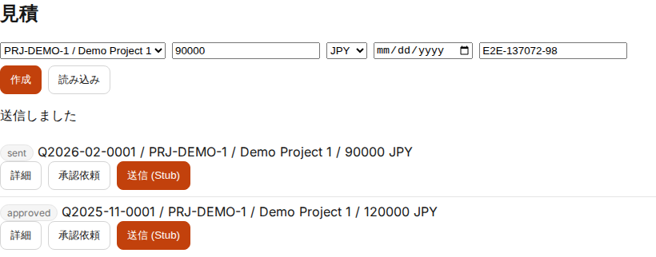
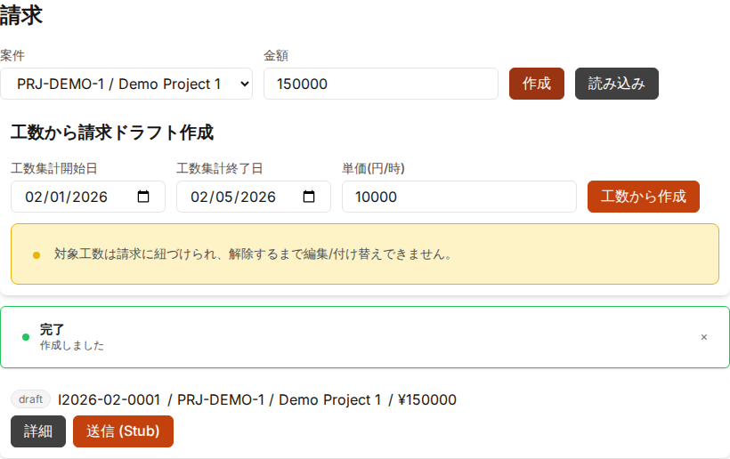
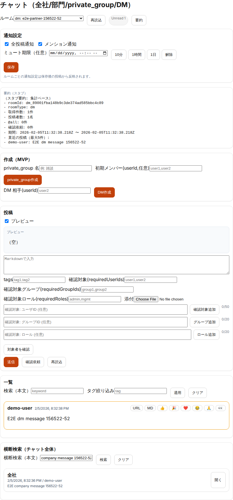
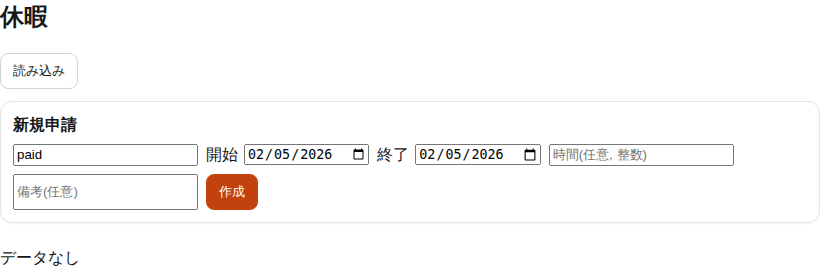

# ERP4 利用者チュートリアル（画面キャプチャ付き）

更新日: 2026-03-02

## 目的

利用者（`user` ロール）が、日次業務で頻出する操作を短時間で習得するためのチュートリアルです。

## 前提

- 対象: `user` ロール（管理操作は対象外）
- 所要時間: 15〜20分
- 画面キャプチャ: `docs/test-results/2026-02-05-frontend-e2e-r1/`
- 詳細仕様は `docs/manual/ui-manual-user.md` を参照

## チュートリアル（Step by Step）

### Step 1: ログイン状態を確認する

1. 画面上部の「現在のユーザー」を開く
2. `ID / Roles / OwnerProjects / Groups` を確認する
3. 通知設定（realtime / digest）を確認する

完了条件:

- 現在のログイン情報と通知設定を確認できる

### Step 2: ダッシュボードで当日の状況を把握する

1. 「ダッシュボード」を開く
2. 「承認状況」「通知」「Alerts」「Insights」を確認する
3. 必要な通知を既読化する

完了条件:

- 当日の優先タスク（承認待ち/通知）を把握できる

### Step 3: 日報を登録する

1. 「日報+WB」を開く
2. 日報本文と関連案件を入力する
3. `Good` / `Not Good` を選択して送信する

完了条件:

- 日報が送信され、履歴に反映される

### Step 4: 工数を入力する

1. 「工数入力」を開く
2. 案件・日付・工数（分）を入力する
3. 必要に応じてタスク・作業種別・場所を入力し、`追加` を押す

完了条件:

- 工数が一覧に追加される

### Step 5: 経費を登録する

1. 「経費入力」を開く
2. 案件・区分・金額・通貨・日付を入力する
3. 領収書URLを入力し、`追加` を押す

完了条件:

- 経費が一覧に追加される

### Step 6: 見積と請求の基本フローを確認する

1. 「見積」を開き、見積作成フォームを確認する
2. 「請求」を開き、請求作成フォームと送信導線を確認する

完了条件:

- 見積・請求の作成〜送信導線を把握できる

### Step 7: チャットで業務連絡を行う

1. 「ルームチャット」を開く
2. `project: ...` の案件ルームを選択し、メッセージを投稿する
3. 必要に応じてメンション対象を指定する

完了条件:

- 案件ルームで投稿と確認ができる

### Step 8: 横断検索で必要情報を再取得する

1. 「検索」を開く
2. 2文字以上のキーワードを入力して検索する
3. 対象（請求/経費/チャット等）を確認する

完了条件:

- 必要情報をUI横断で再取得できる

### Step 9: 休暇申請（終日/時間休）と相談証跡を確認する

1. 「休暇申請」を開く
2. `申請単位` を選択し、終日は `休暇種別/開始日/終了日`、時間休は `開始時刻/終了時刻` も入力する
3. `作成` 後、必要に応じて `詳細` から `相談証跡/メモ` を追加する
4. 証跡を添付しない場合は `相談無し` をチェックし、理由を入力して `申請` する
5. エラー表示（期限不足/事後申請不可/重複）と有給不足警告の表示を確認する

完了条件:

- 休暇申請の基本導線（作成→申請）と相談証跡要件を確認できる

## 次の参照先

- 利用者向け詳細操作: `docs/manual/ui-manual-user.md`
- チャット運用: `docs/manual/chat-guide.md`
- 経費ワークフロー: `docs/manual/expense-workflow-guide.md`
- 休暇運用（詳細）: `docs/manual/ui-manual-user.md`（休暇セクション）
