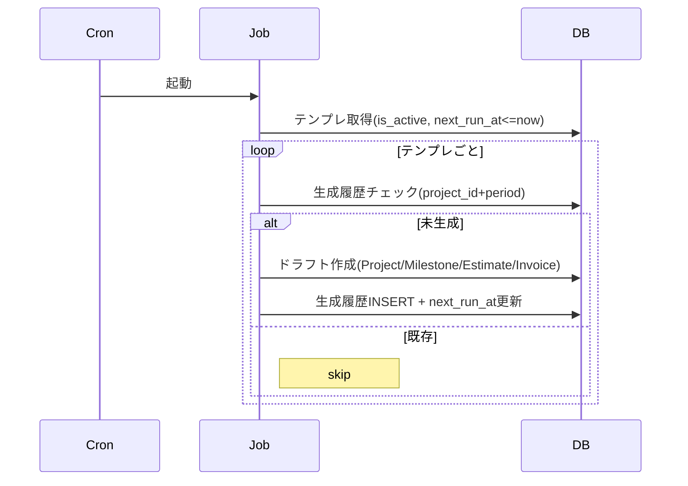

# バッチ/ジョブ仕様たたき台

## 発番ジョブ（number_sequences）
- 対象: 見積(Q)/納品(D)/請求(I)、発注書(PO)、業者見積(VQ)、業者請求(VI)。
- 方式: kind+year+month の row に対して `current_serial` を楽観ロックで+1し、`PYYYY-MM-NNNN` を生成。アプリ側トランザクション内で実行。
- リセット: 月跨ぎ時に row が無ければ自動作成。月またぎの繰返し案件でも月単位で連番がリセットされる。
- エラー: 楽観ロック失敗時はリトライ上限3回。桁あふれは 9999 で検出しアラート。

### 擬似コード
```
tx {
  seq = select ... for update where kind=? and year=? and month=?
  if not exists -> insert current_serial=0 return row // 月跨ぎは新規row
  if seq.current_serial >= 9999 -> raise error       // オーバーフロー検知
  new_serial = seq.current_serial + 1
  update seq set current_serial=new_serial where version=seq.version
  number = format("%s%04d-%02d-%04d", prefix, year, month, new_serial)
  insert target with number
}
retry on conflict up to N times
```

## 定期案件テンプレ生成
- 対象: recurring_project_templates (frequency: monthly/quarterly/semiannual/annual)。
- 処理: next_run_at <= now のテンプレを取得し、案件に紐づく見積/請求ドラフトを自動起案。起案時にテンプレのデフォルト金額/条件をコピーし、番号は発番ジョブで採番。
- スケジュール: 1日1回（タイムゾーン考慮）。
- ログ/リカバリ: 生成結果を記録し、失敗時は再実行可能にする（idempotentに同月重複を防ぐ）。

### 擬似コード
```
jobs = select templates where is_active and next_run_at <= now()
for each t:
  period_key = (project_id, year, month)
  if exists generated where key=period_key -> skip
  create estimate/invoice draft from template defaults
  mark generated with key
  t.next_run_at = calc_next(t.frequency, t.next_run_at)
  save
```

### シーケンス図（Mermaid）


## アラート計算
- 対象: alert_settings (type: budget_overrun/overtime/approval_delay/approval_escalation/delivery_due)。
- 入力データ: 工数集計/予算値、残業時間（time_entries）、承認待ち経過時間（approval_instances）。
- 処理: 設定の閾値・期間に基づき集計し、超過時に alerts レコードを作成し通知をトリガ。通知はメール/ダッシュボード（将来拡張: webhook/Slack）。
- スケジュール: 日次〜時間単位。初期は1日1回でスタート。
- 再送/抑止: 同一条件で open 状態のアラートがあれば再送抑止し、remindAfterHours が設定されている場合は reminderAt で再送する。
- 承認遅延判定: approval_instances.current_step に紐づく approval_steps.createdAt から24h超過をデフォルトとし、ルールごとに可変。通知は設定 recipients/approverGroupId に送る。
- 予算超過: project_id ごとに time_entries × rate で累計し、project.budget 比で判定。+10%閾値は設定から取得。
- 納期超過未請求: project_milestones.due_date <= now かつ invoices が紐付いていないものをカウントし、閾値超過で発火。
- 承認期限エスカレーション: approval_steps の currentStep が閾値超過の場合に発火（/jobs/approval-escalations/run）。

### 擬似コード
```
for setting in alert_settings where is_enabled:
  metric = compute(setting.type, setting.scope, setting.period)
  suppression_key = (setting.id, scope)
  open = find open alert by suppression_key
  if open exists:
     if open.reminder_at <= now:
        send reminder
        update reminder_at
     continue
  if metric > threshold:
     alert = insert alerts(status=open, suppression_key=suppression_key, reminder_at=now+setting.remind_after)
     send email/dashboard
```

## レポート購読/配信ジョブ
- 対象: report_subscriptions / report_deliveries。
- `/jobs/report-subscriptions/run`: isEnabled=true の購読を順次実行して report_deliveries を作成。現状は schedule を判定しないため、運用の cron 側で頻度を制御する。
- `/jobs/report-deliveries/retry`: status=failed かつ retryCount<REPORT_DELIVERY_RETRY_MAX, nextRetryAt<=now を再送。更新時に status=retrying で再送ロック。
- 失敗通知: failed_permanent は REPORT_DELIVERY_FAILURE_EMAILS 宛に通知（未設定ならスキップ）。
- スケジュール案: subscriptions=日次/週次に合わせて cron で実行（例: 02:00 JST）、retry=15〜30分おき。
- 注意: report-subscriptions/run は都度 delivery を作るため、過剰実行に注意（重複配信防止は cron 設定で担保）。
- 運用補助: `scripts/run-report-deliveries.sh`（DRY_RUN=1 で検証可能）

## 承認タイムアウト（将来）
- 設定された承認期限を超過した approval_step を検出し、エスカレーション先へ通知。初期スコープでは未実装、後続で追加。

## バッチ共通
- ログ: 成功/失敗をジョブログに記録し、監査用途で保持。
- 冪等性: 発番以外のジョブも同日再実行しても重複作成しないようキーを持つ（例: recurring生成は project_id+period でユニーク性チェック）。
- 監視: 失敗時はアラート発報（メール）し、ダッシュボードに表示。
- 設定: ジョブスケジュール/閾値は DB の設定値から取得し、管理画面から変更可能にする前提。ジョブは設定を走査して動的に動くように設計。

### 定期案件テンプレ生成シーケンス（簡易）
1. cron起動 → `recurring_project_templates` で `is_active` かつ `next_run_at <= now` を取得
2. project_id + year-month で既存生成履歴がないか確認（重複防止）
3. Project/Milestone/Estimate/Invoice のドラフトを作成（テンプレのdefaultAmount/termsをコピー、採番は number_sequences で生成）
4. 成功時に生成履歴を記録し、テンプレの `next_run_at` を frequency に基づき更新
5. 失敗時はジョブログに記録し、再実行で重複しないようキーで制御
