# ERP4 PoC UI 詳細操作マニュアル（管理者 / 利用者）

## 前提
- 本書は PoC 環境の UI 操作に関する詳細ガイドです。
- 画面キャプチャは 2026-01-15 実行の E2E で取得しています。
  - 証跡: `docs/test-results/2026-01-15-frontend-e2e/`
- 画面の表示内容は demo seed に基づきます（データ差分あり）。
- 対象ロールの目安: admin / mgmt / exec / hr / user

## 目次
- 共通: 現在のユーザー / ダッシュボード / ERP横断検索
- 利用者向け: 日報 / 工数 / タスク / 経費 / 休暇 / 見積 / 請求 / チャット / オフライン
- 管理者向け: 承認 / レポート / 案件 / マイルストーン / マスタ / ベンダー書類 / 管理設定 / 監査閲覧 / HR分析
- 補足: PWA キャッシュ更新

## 共通: 現在のユーザー
- 目的: 現在のログイン情報と通知/オフラインキューの状態確認
- 主な操作: 簡易ログイン/ログアウト、Push同意、オフライン再送
- 補足: Googleログインボタンは `VITE_GOOGLE_CLIENT_ID` 設定時のみ表示されます

### 詳細操作
1. 未ログイン時に `userId` / `roles`（例: `admin,mgmt`）を入力し「簡易ログイン」を押す
2. 任意で `projectIds` / `groupIds` を入力し、認可対象を調整する
3. ログイン済みであれば `ID / Roles / OwnerProjects / Groups` を確認する
4. 「オフライン送信キュー」で `再送` もしくは `再読込` を実行する
5. キュー明細で `再送` / `破棄` を選択する
6. 「Push通知」で配信条件を選択し、同意チェック後に `購読登録` / `購読解除` / `テスト通知` を実行する
7. `ログアウト` を押してローカル認証情報を破棄する

### 入力項目/制約
- Googleログインは `VITE_GOOGLE_CLIENT_ID` が未設定の場合は表示されません
- Push 通知は `VITE_PUSH_PUBLIC_KEY` 未設定だと購読登録に失敗します
- 送信待ちキューはログイン済みの場合のみ処理できます

---

## 共通: ダッシュボード
- 目的: アラート・承認・通知・インサイトの概要確認
- 主な操作: 件数確認、通知の既読化、アラート/インサイトの一覧確認
- 補足: インサイトは権限により表示されない場合があります

### 詳細操作
1. 「承認状況」で承認待ち件数と自分の承認待ち件数を確認する
2. 「通知」で対象通知の `既読` を押して未読を消し込む
3. 「Alerts」で `すべて表示` / `最新のみ` を切り替える
4. 「Insights」で件数・期間・根拠・ヒントを確認する（admin/mgmt/execのみ）

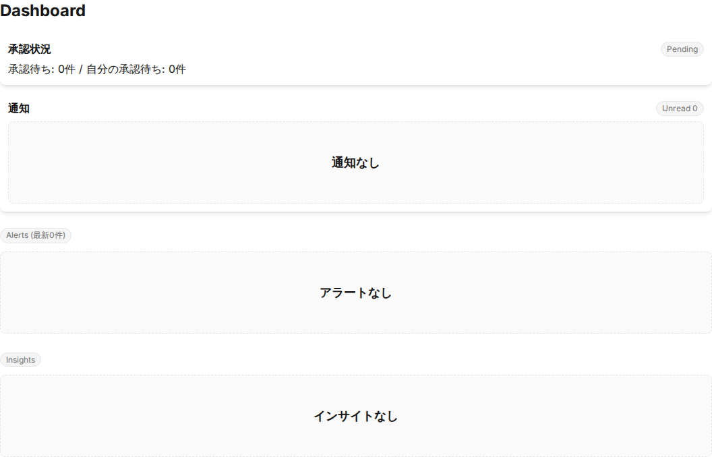

---

## 共通: ERP横断検索
- 目的: 案件/見積/請求/工数/経費/仕入/チャットの横断検索
- 主な操作: 検索語入力 → 検索
- 補足: 2文字以上で検索を実行します

### 詳細操作
1. 「検索語」に 2 文字以上のキーワードを入力する
2. 「取得件数/種別」で取得件数を指定する（1〜50）
3. `検索` を押して結果を取得する
4. チャット結果は `開く` で該当チャットを開く
5. `クリア` で入力と結果を初期化する

---

## 利用者向け（一般ユーザ）

### 日報 + ウェルビーイング
- 目的: 日報の記録とコンディション申告
- 主な操作: Good/Not Good 選択、メモ入力、送信
- 補足: Not Good 選択時のみタグと相談フラグが表示されます

### 詳細操作
1. 「日報本文（任意）」に日報を入力する
2. 「関連案件（任意・複数選択可）」で該当案件を選択する
3. `Good` / `Not Good` を選択する
4. `Not Good` の場合はタグ選択、メモ入力、相談チェックを任意で設定する
5. 「ヘルプ / 相談したい」からヘルプを開く
6. `送信` を押して日報とウェルビーイングを登録する
7. 「日報履歴」で `履歴を読み込み` を実行する

### 入力項目/制約
- `Not Good` 時のタグ/メモは任意です
- 管理者（admin/mgmt）は userId で履歴を絞り込み可能です
- 日報/ウェルビーイングの入力は評価目的で利用しません
- オフライン時は送信待ちキューに保存されます

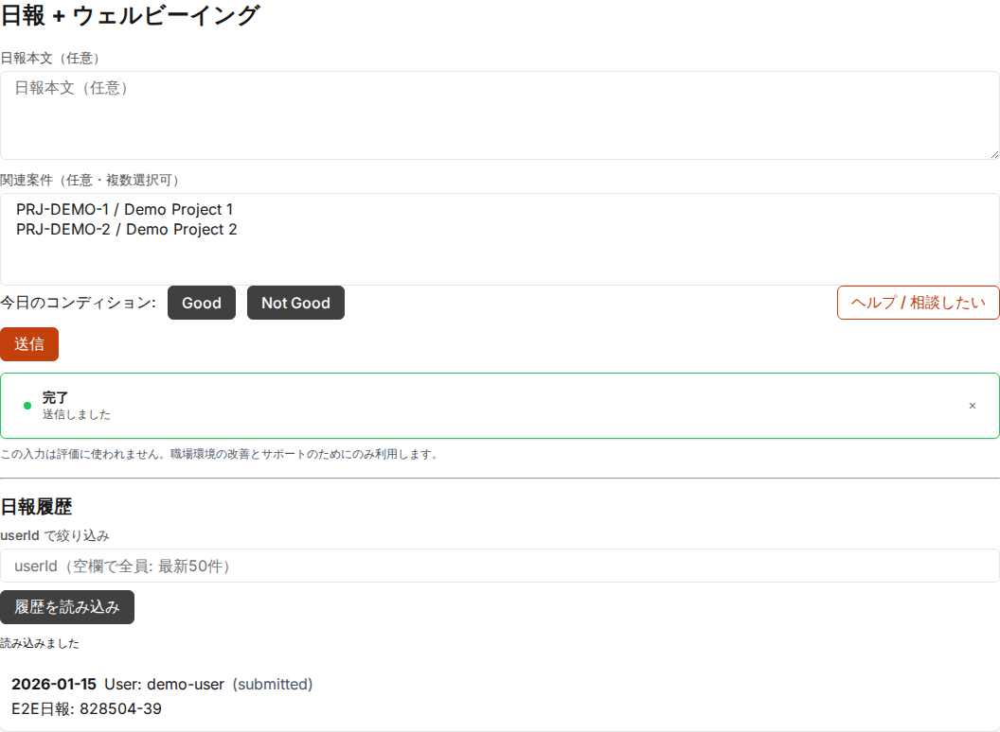

### 工数入力
- 目的: 案件・タスク単位で工数を記録
- 主な操作: 案件/タスク/日付/工数/作業種別/場所の入力 → 追加
- 補足: 15分単位・最大 1440 分の制限があります

### 詳細操作
1. 「案件」で対象案件を選択する
2. 「タスク」は任意で選択する（案件選択後に候補が表示）
3. 「日付」「工数 (分)」を入力する
4. 「作業種別」「場所」を任意で入力する
5. `追加` を押して工数を保存する

### 入力項目/制約
- 工数は 1〜1440 分、15 分単位
- 案件・日付は必須
- オフライン時は送信待ちキューに保存されます

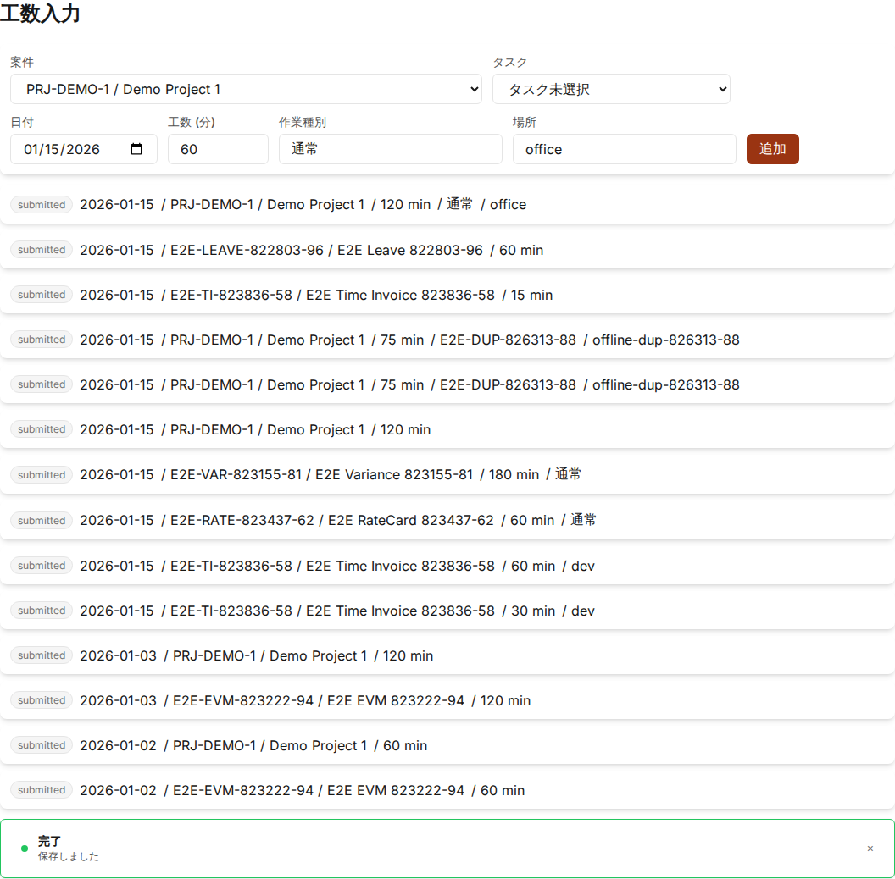

### タスク
- 目的: 案件タスクの登録・進捗・ベースライン確認
- 主な操作: 案件選択、タスクの追加/更新、ベースラインの閲覧
- 補足: 依存関係や進捗率はタスク編集で更新します

### 詳細操作
1. 「案件選択」で対象案件を選択し `読み込み` を押す
2. 「ベースライン」で `ベースライン作成` / `一覧更新` を実行する
3. 「新規作成」でタスク名・ステータス・進捗率・日付を入力し `作成`
4. 既存タスクは `編集` から更新し `更新` / `キャンセル` を選択
5. 編集時に「先行タスク選択」で依存関係を設定する
6. 親タスクを変更した場合は「親タスクの変更理由」を入力する
7. 管理者（admin/mgmt）は `削除` を実行できる（理由入力必須）

### 入力項目/制約
- 親タスク変更時は理由入力が必須
- 進捗率は 0〜100
- `削除` は admin/mgmt のみ

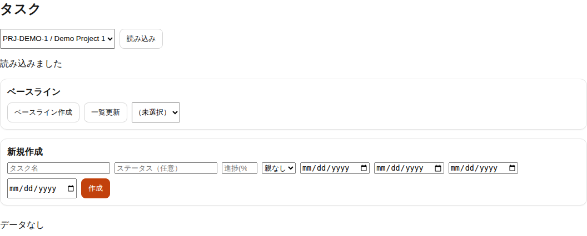

### 経費入力
- 目的: 経費の登録と領収書リンクの管理
- 主な操作: 案件/区分/金額/通貨/日付の入力 → 追加、領収書 URL の登録
- 補足: 共通経費は「共通経費」チェックで登録できます

### 詳細操作
1. 「案件選択」で対象案件を選択する
2. 「区分」「金額」「通貨」「日付」を入力する
3. 「共通経費」に該当する場合はチェックする
4. 「領収書URL」を任意で入力し `追加` を押す
5. `未登録のみ表示` / `全件表示` で領収書未登録の絞り込みを切り替える

### 入力項目/制約
- 金額は 1〜10,000,000
- 通貨は 3 文字の英大文字（例: JPY）
- オフライン時は送信待ちキューに保存されます

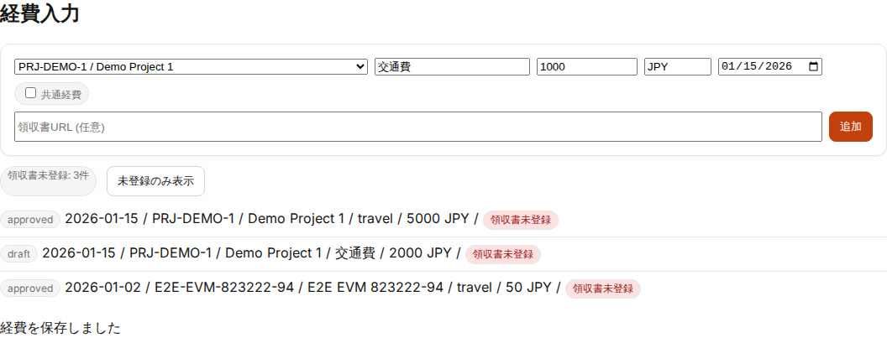

### 休暇
- 目的: 休暇の申請と一覧確認
- 主な操作: 休暇種別/期間/時間/備考の入力 → 作成 → 申請
- 補足: 工数重複がある場合は警告が表示されます

### 詳細操作
1. `読み込み` で既存の休暇申請を取得する
2. 「休暇種別」「開始日」「終了日」を入力する
3. 任意で「休暇時間」「備考」を入力し `作成`
4. 一覧の `申請` を押して申請状態に更新する
5. 工数重複がある場合は「工数の重複」に該当工数が表示される

### 入力項目/制約
- 休暇時間は整数のみ
- 申請は `draft` 状態のみ

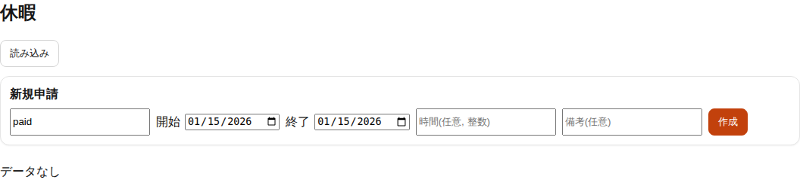

### 見積
- 目的: 見積ドラフトの作成と承認依頼
- 主な操作: 案件選択 → 金額/通貨/有効期限/備考 → 作成 → 承認依頼 → 送信（Stub）

### 詳細操作
1. 「案件選択」「金額」「通貨」「有効期限」「備考」を入力する
2. `作成` で見積ドラフトを作成する
3. `読み込み` で一覧を更新する
4. 一覧の `承認依頼` を押して承認フローに回す
5. 承認済みの見積は `送信 (Stub)` で送信状態にする
6. `詳細` を開き、送信履歴を `更新` で取得する

### 入力項目/制約
- `承認依頼` は `draft` のみ
- `送信 (Stub)` は `approved` または `sent` のみ

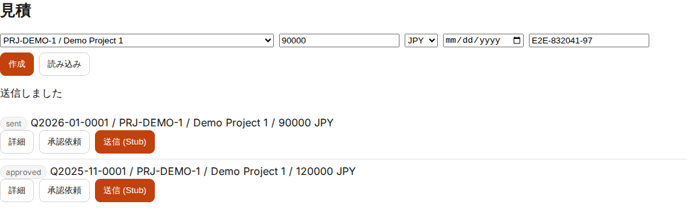

### 請求（ドラフト）
- 目的: 工数や金額から請求ドラフトを作成
- 主な操作: 案件選択 → 金額設定 → 作成、工数期間から作成、詳細確認
- 補足: 工数から作成した場合、対象工数は請求に紐づきます

### 詳細操作
1. 「案件」「金額」を入力し `作成` で請求ドラフトを作成する
2. `読み込み` で一覧を更新する
3. 「工数から請求ドラフト作成」で期間と単価を指定し `工数から作成`
4. 一覧の `詳細` を開き、送信履歴を `更新` で確認する
5. `送信 (Stub)` で送信状態にする
6. `draft` 状態では「工数リンク解除」が利用可能

### 入力項目/制約
- 工数から作成した場合、対象工数は解除するまで編集/付け替え不可

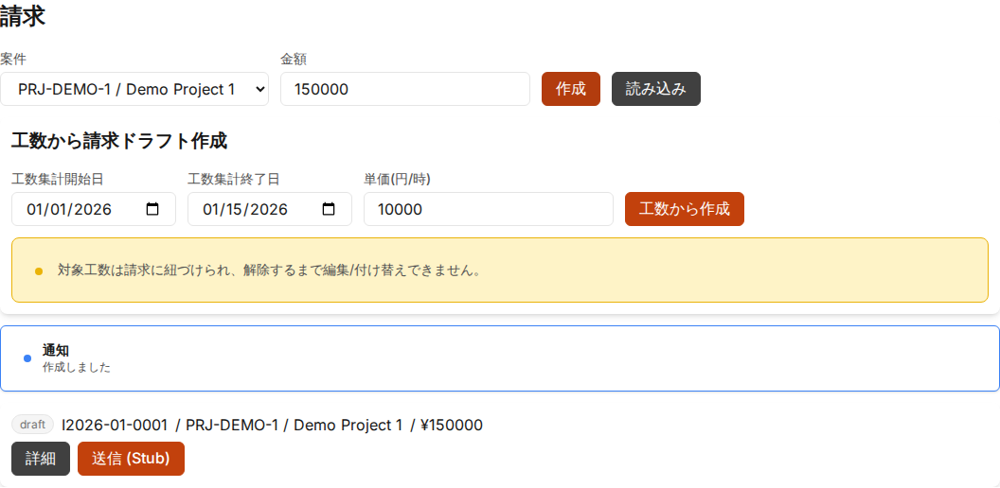

### プロジェクトチャット
- 目的: プロジェクト単位のコミュニケーション
- 主な操作: 投稿、メンション、既読の確認

### 詳細操作
1. 「案件選択」でプロジェクトを選ぶ
2. `読み込み` で最新メッセージを取得する
3. `要約` を押して要約（スタブ）を取得する
4. 本文・タグ・添付を入力し `投稿` を押す
5. メンションはユーザ/グループを補完から追加し、必要に応じて `@all` を選ぶ
6. 「確認依頼」では確認対象ユーザIDを入力し `確認依頼` を押す
7. 一覧で `OK` を押して確認済みにする
8. リアクションボタンでスタンプを付ける
9. `もっと読み込む` で過去メッセージを取得する

### 入力項目/制約
- メッセージ本文は 2000 文字まで
- `@all` は候補が許可されている場合のみ表示

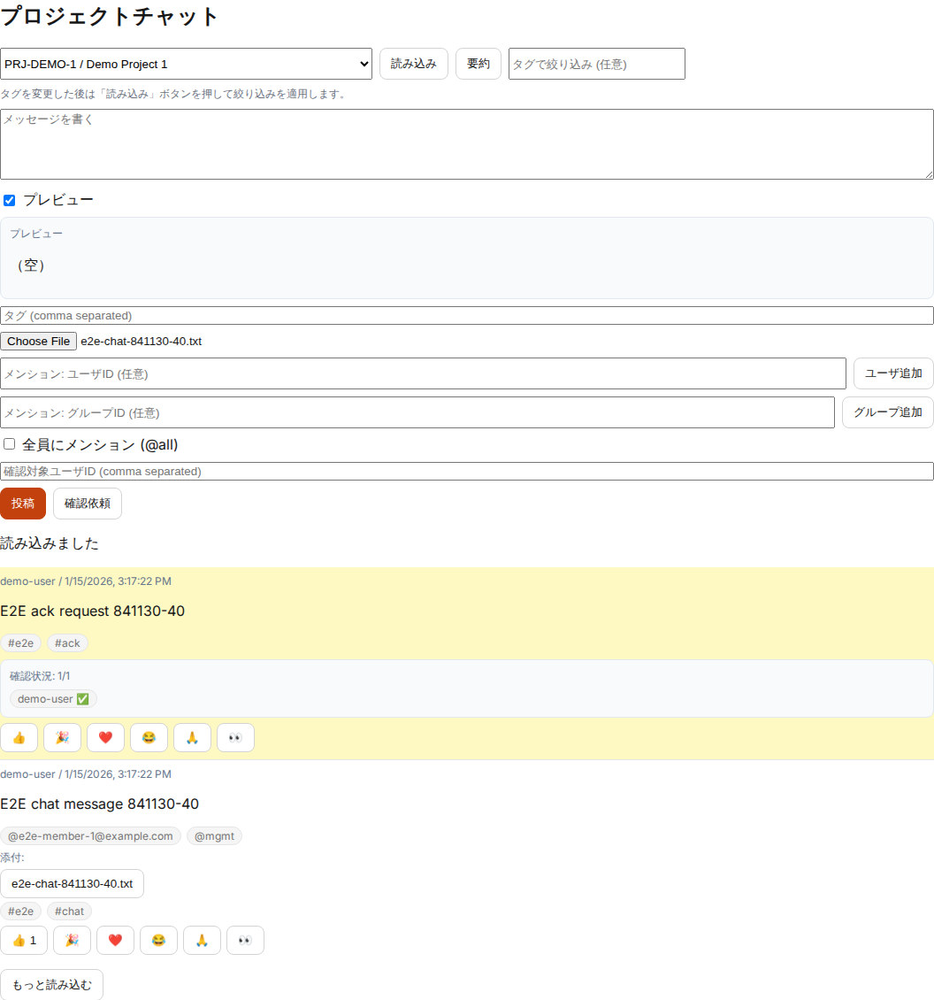

### ルームチャット（DM/Private Group）
- 目的: ルーム単位のコミュニケーション
- 主な操作: ルーム選択、投稿、メンション
- 補足: DM/Private Group の利用可否は管理設定に依存します

### 詳細操作
1. 「ルーム」で対象ルームを選択し `再読込` を押す
2. `要約` を実行する（外部要約は許可済みルームのみ）
3. 「private_group 作成」で名称と初期メンバーを入力し作成する
4. 「DM 作成」で相手 userId を入力し作成する
5. private_group では「招待」でメンバーを追加する
6. 投稿欄で本文/タグ/添付/確認対象を設定し `送信` / `確認依頼`
7. 一覧でフィルタを設定し `適用` / `クリア`
8. `さらに読み込む` で過去メッセージを取得する
9. 「横断検索（チャット全体）」で検索し `開く` で該当ルームを開く

### 入力項目/制約
- ルーム未選択時は投稿・フィルタ操作が無効
- external_chat ロールは外部要約が非表示

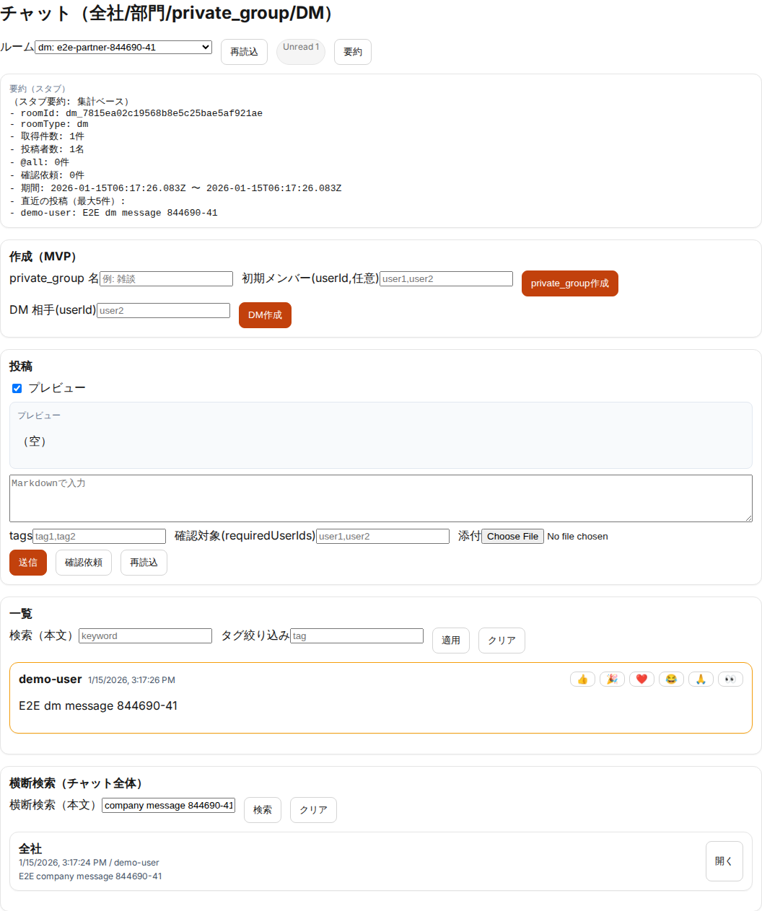

### オフライン動作（参考）
- 目的: オフライン時の送信待ちと復旧後の再送
- 主な操作: オフライン保存 → 再送
- 補足: 送信待ちは「現在のユーザー > オフライン送信キュー」で確認

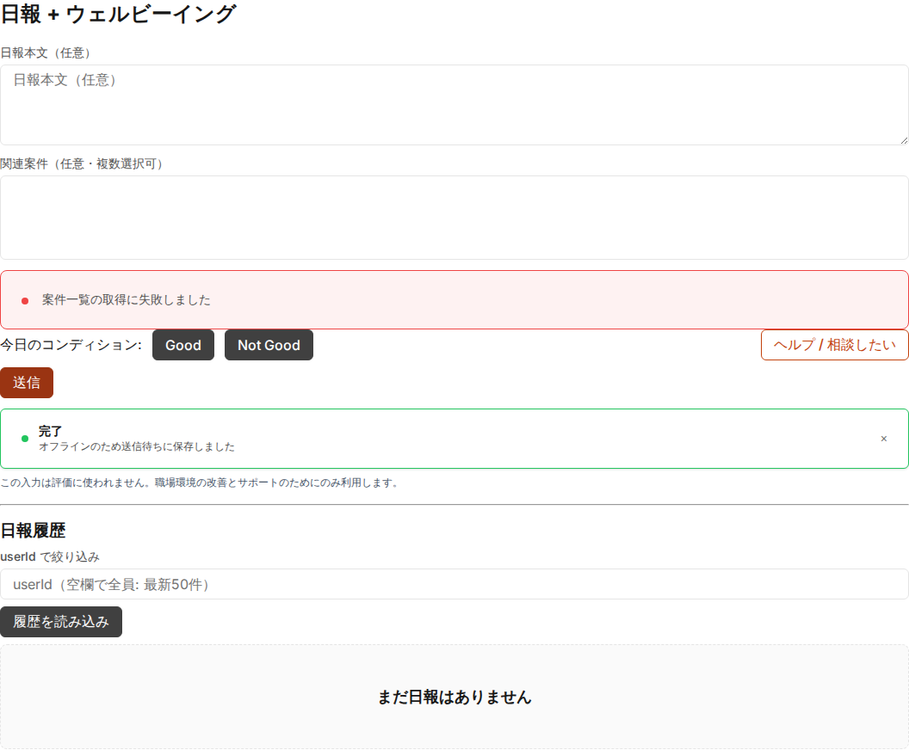

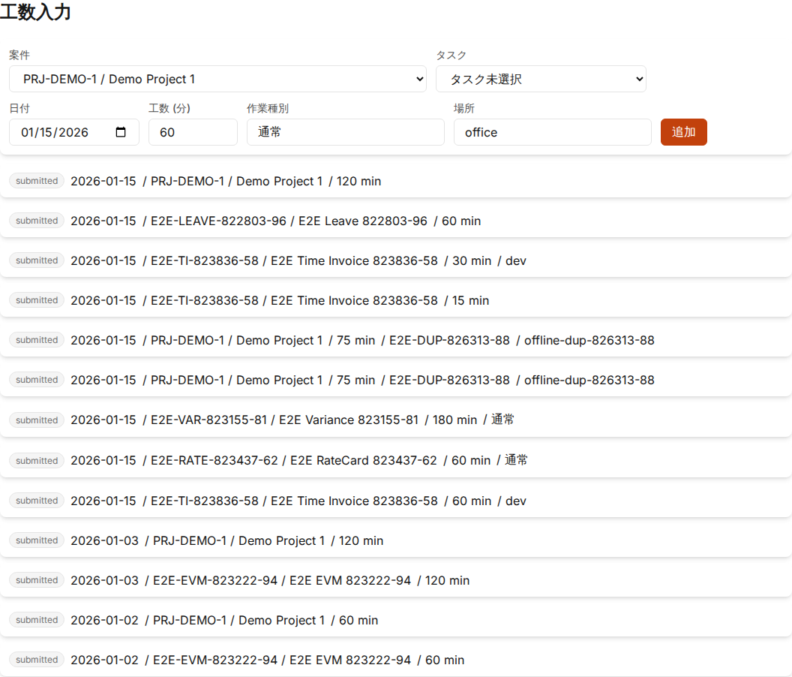

---

## 管理者向け（admin/mgmt/exec）

### 承認
- 目的: 承認対象の一覧と状態確認
- 主な操作: フィルタ条件の指定、承認/却下、理由の入力
- 補足: flowType / status / projectId / approver などで絞り込み可能

### 詳細操作
1. flowType / status / projectId / approverGroupId / approverUserId / requesterId を指定する
2. `再読込` で一覧を更新する
3. 対象行に却下理由を任意入力する
4. `承認` / `却下` を実行する

### 入力項目/制約
- `承認対象外` は現在の承認者/グループと一致しない場合に表示されます

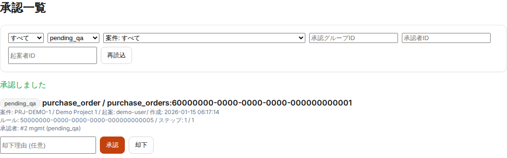

### レポート
- 目的: 工数・予実・稼働の可視化
- 主な操作: 期間/案件/ユーザの設定、工数・残業・バーンダウン・EVM の取得
- 補足: ベースラインが未設定の場合はバーンダウン取得ができません

### 詳細操作
1. `from/to` に期間を入力する
2. 「案件選択」から案件を選ぶ
3. `PJ別工数` を押して案件別工数を取得する
4. `グループ別工数` では userIds を指定して取得する
5. `個人別残業` では userId を指定して取得する
6. ベースラインを選択し `バーンダウン` を取得する
7. `EVM` を取得する

### 入力項目/制約
- `from/to` は YYYY-MM-DD 形式
- バーンダウンはベースラインが必須

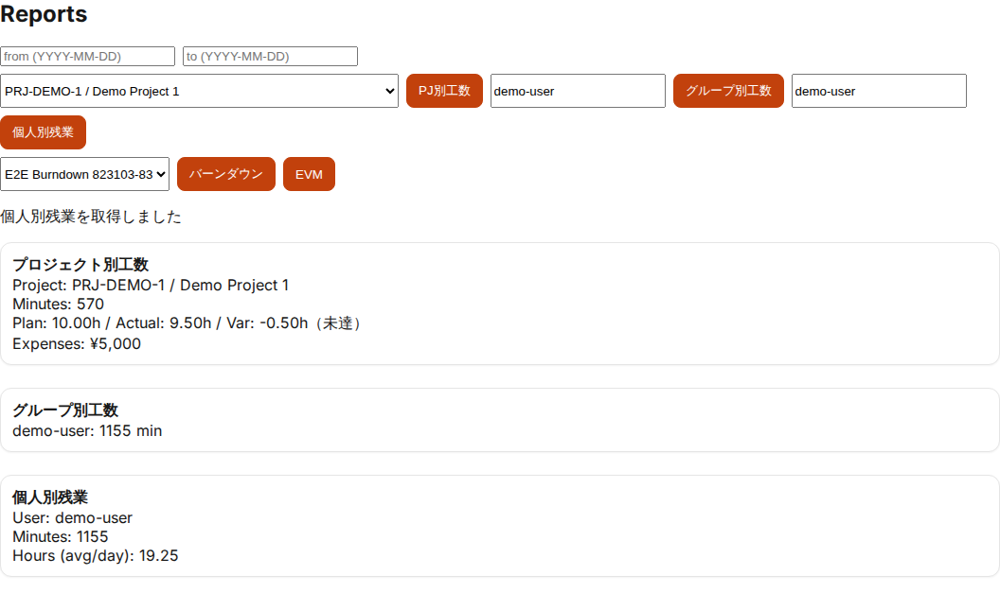

### プロジェクト / メンバー管理
- 目的: 案件情報とメンバー構成の確認・管理
- 主な操作: 案件の追加/更新、親案件の設定、期間/予算/計画工数の登録、メンバー割当

### 詳細操作
1. 「案件コード」「案件名称」「ステータス」を入力する
2. 「親案件」「顧客」を選択する
3. 「開始日」「終了日」「予定工数」「予算コスト」を入力する
4. `追加` / `更新` を押す
5. 一覧の `編集` でフォームに反映する
6. 一覧の `メンバー管理` を開く
7. ユーザIDと権限を入力し `追加` する
8. `再読込` でメンバー一覧を更新する
9. 「候補検索」でユーザ候補を検索し `選択` する
10. `CSVエクスポート` / `CSVインポート` で一括管理する
11. 権限変更は `権限更新`、削除は `削除`

### 入力項目/制約
- 親案件変更時は「親案件の変更理由」が必須
- メンバー権限変更は admin/mgmt のみ
- CSV 形式: `userId,role`（role は `member` / `leader`）

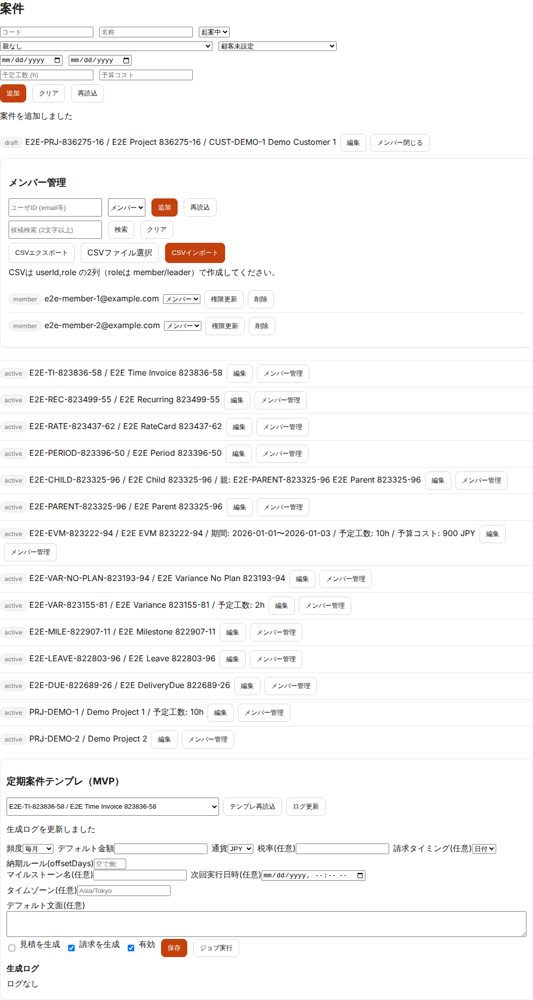
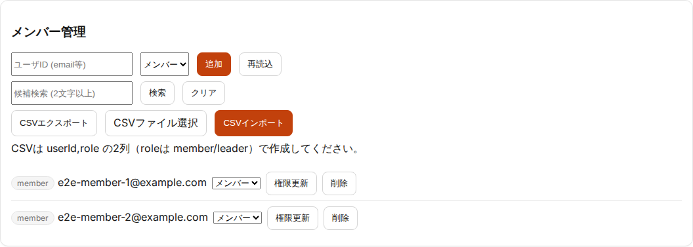

### 定期案件テンプレ（MVP）
- 目的: 定期案件の見積/請求ドラフトを自動生成
- 主な操作: テンプレ設定、ジョブ実行、生成ログ確認
- 補足: admin/mgmt のみ操作可能

### 詳細操作
1. 「案件を選択」で対象案件を指定する
2. `テンプレ再読込` / `ログ更新` で最新情報を取得する
3. 頻度、金額、通貨、税率、請求タイミング、納期ルールを設定する
4. マイルストーン名、次回実行日時、タイムゾーン、文面を設定する
5. 「見積を生成」「請求を生成」「有効」を設定する
6. `保存` でテンプレを保存する
7. `ジョブ実行` で生成を実行し、生成ログで結果を確認する

### マイルストーン
- 目的: 請求連動のマイルストーン登録と納期確認
- 主な操作: 案件選択、マイルストーン登録/更新、納期リスト取得
- 補足: 納期レポートは期間指定で取得できます

### 詳細操作
1. 「案件選択」で対象案件を選択し `読み込み` を押す
2. 「名称」「金額」「請求タイミング」「納期」「税率」を入力する
3. `作成` / `更新` で登録する
4. 一覧の `編集` でフォームに反映する
5. 一覧の `削除` で削除（理由入力が必須）
6. 「未請求（納期範囲）レポート」で `from/to` を指定し `取得`

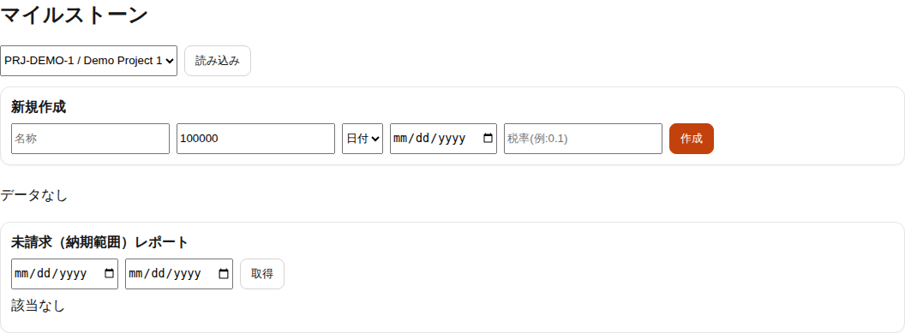

### マスタ管理
- 目的: 取引先やタグ等のマスタデータ管理
- 主な操作: 顧客/業者/連絡先の追加・更新・確認

### 詳細操作
1. 顧客/業者のコード・名称・ステータスを入力する
2. 追加情報（請求書番号、税区分、住所、外部IDなど）を入力する
3. `追加` / `更新` / `クリア` / `再読込` を実行する
4. 一覧の `編集` でフォームに反映する
5. 連絡先は紐付け先（顧客/業者）を選択する
6. 連絡先の氏名・メール・電話・役割を入力し `追加` する

### 入力項目/制約
- 顧客/業者はコード・名称が必須
- 連絡先は氏名が必須
- 紐付け先を変更すると入力中の情報が破棄されます

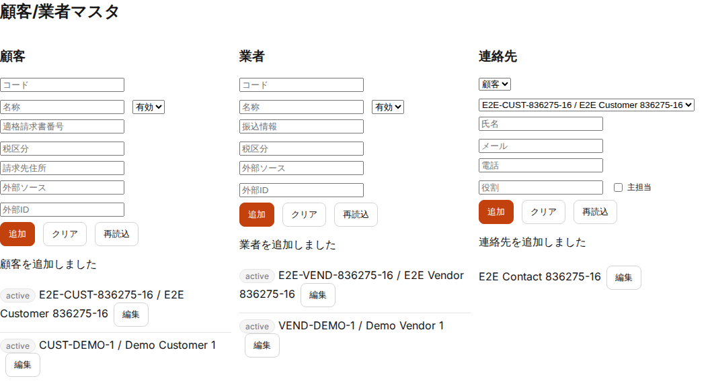

### ベンダー書類（発注 / 仕入見積 / 仕入請求）
- 目的: 発注書・仕入見積・仕入請求の管理
- 主な操作: 案件/業者の選択、番号・金額・期日の登録、一覧確認

### 詳細操作
1. 発注書で案件・業者・金額・通貨・発行日・納期を入力し `登録`
2. `再読込` で一覧を更新し、`承認依頼` を実行する
3. 仕入見積で案件・業者・見積番号・金額・通貨・発行日・書類URLを入力し `登録`
4. 仕入請求で案件・業者・請求番号・金額・通貨・受領日・支払期限・書類URLを入力し `登録`
5. 仕入請求の `承認依頼` を実行する

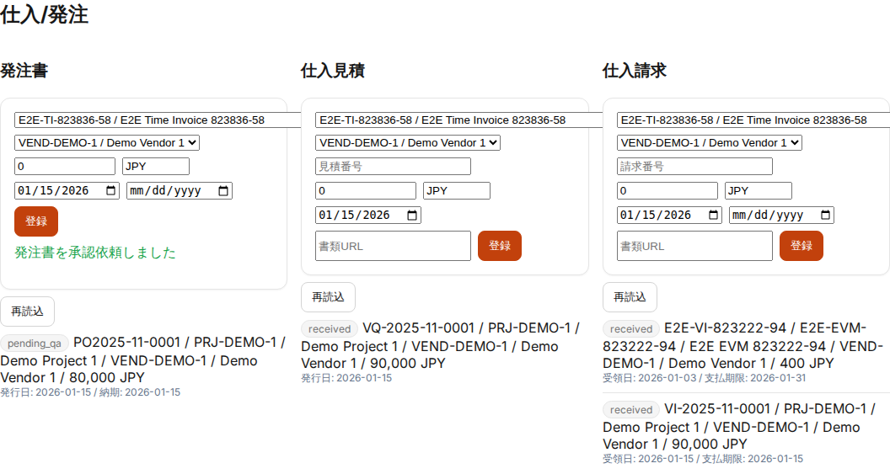
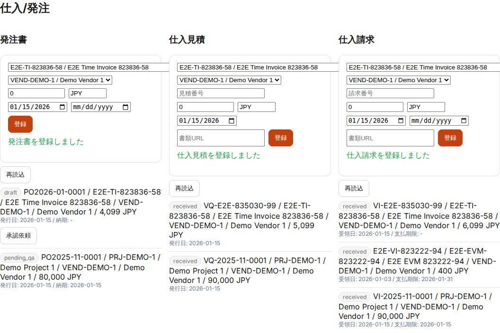

### 管理設定
- 目的: 全体設定・運用設定の確認
- 主な操作: アラート設定 / 承認ルール / 帳票テンプレート / 連携設定 / レポート配信 / チャット設定 / 単価設定
- 補足: JSON 入力欄は構造が正しい場合のみ保存されます

### 詳細操作（チャット設定）
1. 「user/hr の private_group 作成を許可」「DM 作成を許可」を切り替える
2. `保存` / `再読込` を実行する

### 詳細操作（チャットルーム設定）
1. 公式ルームを選択し `再読込` を実行する
2. 「外部ユーザ参加を許可」「外部連携を許可」を設定する
3. `保存` で反映する
4. 外部ユーザ追加は userId を入力して `メンバー追加` を実行する

### 詳細操作（単価）
1. 案件フィルタや workType を指定して `取得`
2. 追加フォームで role / workType / unitPrice / currency / validFrom / validTo を入力し `追加`
3. 不要な単価は `無効化` する

### 詳細操作（アラート設定）
1. 種別・閾値・期間・projectId（任意）を入力する
2. 通知先（emails/roles/users/webhooks）を指定する
3. 通知チャネルを選択し `作成` / `更新` する
4. 一覧の `無効化/有効化` と `編集` を実行する

### 詳細操作（承認ルール）
1. flowType を選択する
2. `conditions (JSON)` と `steps (JSON)` を入力する
3. `作成` / `更新` / `再読込` を実行する

### 詳細操作（テンプレ設定）
1. 種別とテンプレを選択する
2. 番号ルール・ロゴURL・署名テキスト・layoutConfig を入力する
3. `作成` / `更新` / `再読込` を実行する
4. 一覧の `編集` / `デフォルト化` を実行する

### 詳細操作（レポート購読）
1. reportKey / format / schedule / channels / params / recipients を設定する
2. `dry-run` の有無を設定する
3. `作成` / `更新` を実行する
4. 一覧の `実行` / `無効化` / `配信履歴` を実行する
5. `一括実行` で全購読を実行する

### 詳細操作（外部連携設定）
1. 種別・名称・プロバイダ・ステータス・スケジュールを入力する
2. `config (JSON)` を入力し `作成` / `更新` を実行する
3. 一覧の `実行` / `履歴表示` を実行する

### 入力項目/制約
- JSON 入力が不正な場合は保存されません
- チャットルーム設定は admin/mgmt のみ

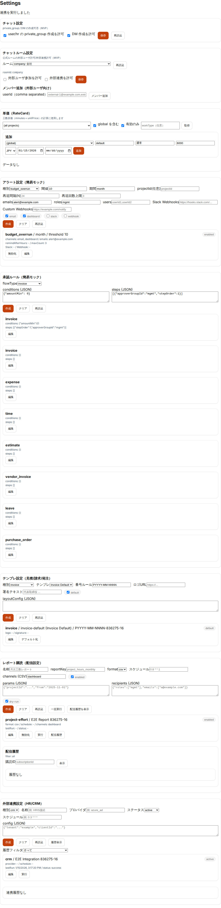

### 監査閲覧（Break-glass）
- 目的: 監査目的のチャット閲覧（Break-glass）
- 主な操作: 対象ルーム/期間/ユーザの指定、閲覧理由の入力
- 補足: 利用ログが監査用に記録されます

### 詳細操作
1. `projectId` または `roomId` を入力する
2. `viewerUserId` / `reasonCode` / `ttlHours` / 期間（任意）を入力する
3. `reasonText` を入力し `申請` する
4. 一覧で `承認` / `却下` を実行する
5. 承認済みの申請で `閲覧` を実行する

### 入力項目/制約
- mgmt/exec のみ利用可能（admin は不可）
- `ttlHours` は 1〜168
- 監査閲覧は `approved` 状態のみ可能

### HR 分析（HR グループ向け）
- 目的: ウェルビーイング指標の確認
- 主な操作: 指標の閲覧、傾向の把握

### 詳細操作
1. 「開始日」「終了日」「閾値」を設定し `更新` を実行する
2. グループ一覧から対象グループを選択する
3. 時系列の `更新` で月次の推移を取得する

### 入力項目/制約
- 閾値未満のデータは匿名性確保のため非表示
- 評価目的の利用は禁止

---

## 補足
- PWA のキャッシュ更新確認: サービスワーカー更新後の表示確認に利用します。

- `pwa push subscribe flow` は `VITE_PUSH_PUBLIC_KEY` 未設定のため E2E ではスキップしています。
- 画面デザインは `@itdojp/design-system` 適用済みです（compact density）。
