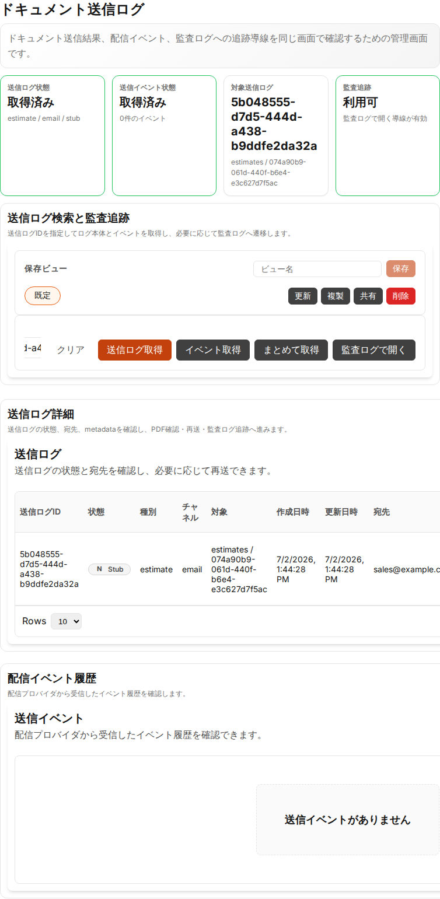
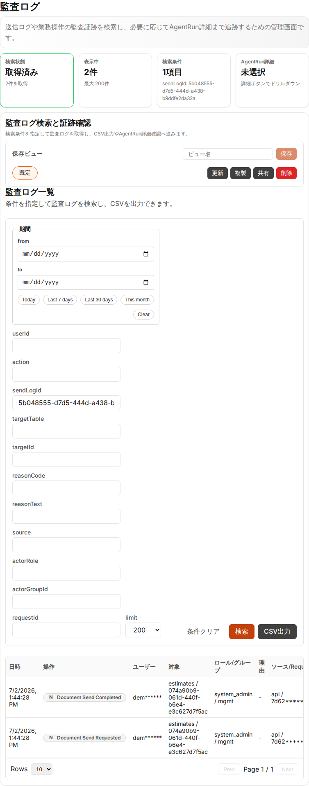

# UI/UX Phase 10: Document send logs and audit logs

Date: 2026-07-02

## Scope

- `DocumentSendLogs`: add a workflow header, send-log/audit summary metrics, and task-oriented panels for log lookup, log detail, and delivery events.
- `AuditLogs`: add a workflow header, audit-search summary metrics, and a task-oriented panel for evidence search, CSV export, and AgentRun drill-down.
- Preserve existing navigation labels, input labels, actions, API paths, and deep-link behavior from send logs to audit logs.

## Evidence

### Document send logs

### Audit logs

## Verification

- `npm run test --prefix packages/frontend -- DocumentSendLogs.test.tsx AuditLogs.test.tsx`
  - PASS: 2 files / 11 tests
- `npm run format:check --prefix packages/frontend`
  - PASS
- `npm run typecheck --prefix packages/frontend`
  - PASS
- `npm run lint --prefix packages/frontend`
  - PASS
- `npx --prefix packages/frontend prettier --check packages/frontend/e2e/frontend-uiux-phase10-document-audit-logs.spec.ts`
  - PASS
- Targeted local E2E:
  - `E2E_GREP='phase 10 document send and audit logs UX/UI summary renders' ./scripts/e2e-frontend.sh`
  - PASS: 1 test

## Notes

- The targeted E2E creates an estimate, sends it, loads the resulting send log, verifies the new send-log summary and panels, opens audit logs through the existing deep link, and verifies the audit-log summary plus the filtered audit rows.
- Evidence images are committed under `docs/test-results/2026-07-02-uiux-phase10-document-audit-logs/` so that the PR can link to GitHub-hosted files.
