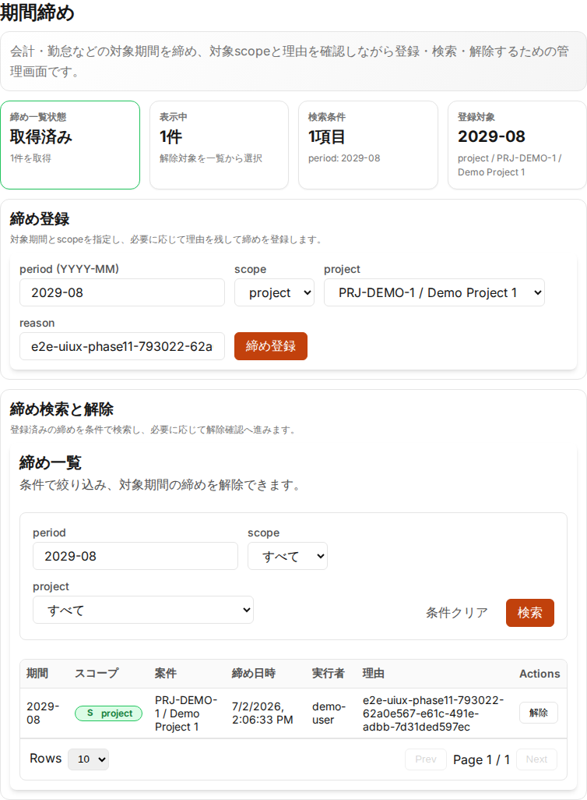

# UI/UX Phase 11: Period locks

Date: 2026-07-02

## Scope

- `PeriodLocks`: add a workflow header, period-lock summary metrics, and task-oriented panels for lock registration, search, and unlock actions.
- Preserve existing navigation label, page heading, input labels, buttons, API paths, and period-lock search/create behavior.

## Evidence

## Verification

- `npm ci --prefix packages/frontend`
  - PASS: found 0 vulnerabilities
- `npm run test --prefix packages/frontend -- PeriodLocks.test.tsx`
  - PASS: 1 file / 4 tests
- `npm run format:check --prefix packages/frontend`
  - PASS
- `npm run typecheck --prefix packages/frontend`
  - PASS
- `npm run lint --prefix packages/frontend`
  - PASS
- `npx --prefix packages/frontend prettier --check packages/frontend/e2e/frontend-uiux-phase11-period-locks.spec.ts`
  - PASS
- Targeted local E2E:
  - `E2E_GREP='phase 11 period lock UX/UI summary renders' ./scripts/e2e-frontend.sh`
  - PASS: 1 test

## Notes

- The targeted E2E opens the period-lock screen, verifies the new summary and workflow panels, cleans up any existing lock for the selected future period, creates a project-scoped period lock, searches by period, captures screenshot evidence, and cleans up the created lock for rerun safety.
- Evidence images are committed under `docs/test-results/2026-07-02-uiux-phase11-period-locks/` so that the PR can link to GitHub-hosted files.
