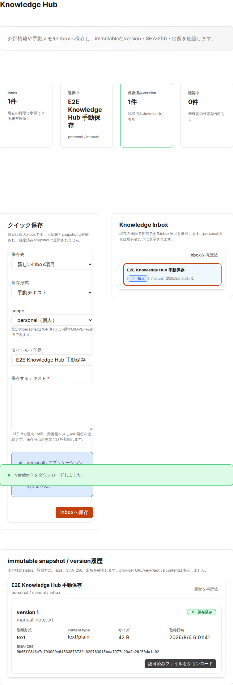

# Issue #2012 Knowledge snapshot UI / E2E verification (PR B)

- 実施日: 2026-08-06 JST
- branch: `feat/2012-knowledge-snapshot-ui`
- base: `7521ea2ba25008081206102392c2f20390f68fd2`
- 対象: Issue #2012 / Epic #2003 Workstream 04 PR B (`Closes #2012`)
- 検証種別: frontend unit / UI core coverage / real-backend Playwright E2E / local PostgreSQL / local artifact storage
- 非該当: production、Sakura VPS、target environment、実Google Drive/Sakura Object Storage credential、provider cutover、source delete

## 実装・検証範囲

- lazy-loaded `Knowledge Hub` navigation/section
- 既定 `personal` / 新規 Inbox / text の安全な初期値
- text、URL、PDF、image の明示的な manual capture
- organization group IDs と操作ごとの明示確認
- 選択した既存項目への immutable version 追加
- status、capture method、content type、size、取得日時、SHA-256、source URL の表示
- ready snapshot の ERP4 認可済みdownload
- partial failure 時の項目保持、current-session request key による read-only reconciliation
- allowlist error codeだけを使うsanitized表示と、provider URL/key・active content非表示

## Verification

| Command / check                            | Result | Evidence                                                                                |
| ------------------------------------------ | ------ | --------------------------------------------------------------------------------------- |
| Knowledge Hub focused unit                 | PASS   | 4 files、53/53 tests、fail/skip/todo 0                                                  |
| frontend lint / format / typecheck / build | PASS   | package標準commandがexit 0                                                              |
| repository standard gates                  | PASS   | lint / format / typecheck / build、backend 1,815/1,815 tests                            |
| UI core coverage gate                      | PASS   | 85 files、495/495 tests。S 68.71%、B 61.81%、F 67.99%、L 71.13%                         |
| real-backend Knowledge Hub E2E             | PASS   | 1/1。personal text capture、ready/version/hash/provenance、download filename/bodyを検証 |
| screenshot visual review                   | PASS   | synthetic dataのみ。secret、実identifier、provider URL/key、個人情報なし                |

## E2E command and environment boundary

```bash
E2E_GREP='@knowledge-hub' \
E2E_CAPTURE=1 \
E2E_EVIDENCE_DIR="$PWD/docs/test-results/2026-08-06-issue2012-knowledge-snapshot-ui" \
./scripts/e2e-frontend.sh
```

E2Eはrepository標準scriptでephemeral test DBを初期化し、header authのsynthetic `demo-user`、backendの既定local Knowledge artifact provider、Vite frontendを使用した。実Google Drive、実Sakura Object Storage、production credentialへは接続していない。

## Screenshot evidence

[PNGを直接開く](2026-08-06-issue2012-knowledge-snapshot-ui/01-knowledge-hub-manual-capture.png)



画面には synthetic title、personal scope、ready status、version 1、content type、size、SHA-256、認可済みdownload導線を表示している。provider URL/keyやactive contentは表示していない。

## Security / privacy verification

- API response normalizerは業務上必要なfieldだけを新しいobjectへcopyし、未知のprovider fieldをUI stateへ渡さない。
- 非2xx responseは既知error codeだけをallowlistし、生message/bodyを表示しない。
- current-session request keyはUI、localStorage、error、証跡へ表示・永続化しない。
- URL credential、非HTTP(S)、oversize text/file、非対応MIME、空file、organization未確認をmutation前に拒否する。
- ready以外のsnapshotにはdownload actionを表示しない。
- download bodyはE2Eで保存したtextと完全一致することを確認した。

## Rollback

- frontend navigation、`KnowledgeHub` section、frontend API/model、E2E/manual/evidenceをこのPR単位でrevertする。
- backend API、Prisma schema/migration、storage provider/env契約には変更がないため、PR Aで導入済みのrepository-side snapshot APIはそのまま維持できる。
- source file削除、provider切替、DB rollbackは不要。

## 未検証・後続

- 実Google Drive/Sakura Object Storageでのupload/download/cutover
- Sakura VPS / target-environment lifecycle
- production credential、production data、実SNS/authenticated page capture
- browser実行E2EでのPDF/image/URL capture（API/service境界とfrontend unitでは検証済み）

これらを本PRの成功またはIssue #2012のrepo-side完了と混同しない。実環境移行はEpic #1975等の独立した承認・証跡を必要とする。
