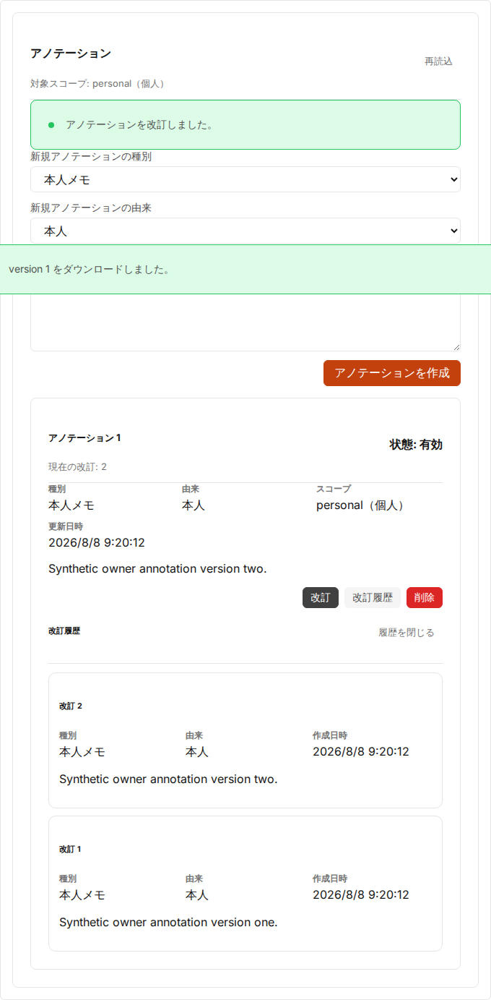
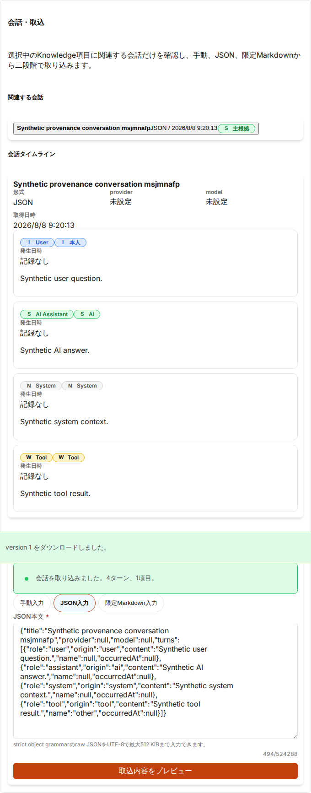
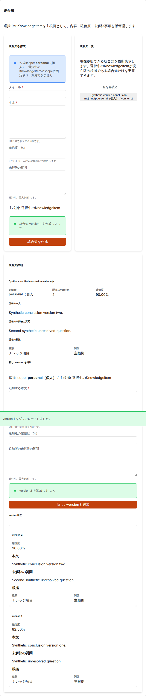

# Issue #2013 Knowledge provenance UI検証（PR C）

## 対象

- Issue: `#2013`
- 対象: Knowledge Hubの本人annotation、bounded conversation import/timeline、versioned Synthesis/provenance
- data: synthetic fixtureのみ
- external LLM、Google Drive、さくらオブジェクトストレージ、Sakura VPS、production credential: 未使用

## UI契約

- snapshot、annotation revision、conversation turn、Synthesis version/sourceを別entityとして表示する。
- annotation kind/origin、conversation role/origin、Synthesis/未解決事項/provenanceを色だけでなくtext labelとsemantic markupで区別する。
- importはmanual/strict JSON/限定Markdownをpreviewし、明示confirm後にだけcommitする。
- preview tokenとCSPRNG request keyはcomponent memoryだけに保持し、画面、URL、localStorage、証跡へ出さない。
- 一度開いたworkspace tabはitem選択中だけmountを維持し、tab切替で未保存draft、preview token、同一request keyの明示retry状態を失わない。
- API responseはallowlistで正規化し、未知field、raw backend error、actor ID、content hash、provider URL/keyをUI stateへcopyしない。
- unauthorizedとnot-foundは同じ非開示案内に正規化する。
- inaccessible sourceは本文・識別子を展開せず`参照不可（redacted）`と表示する。
- 一覧・履歴・turnは`nextCursor`を破棄せず、明示的な追加読込で後続pageへ到達できる。
- Synthesis一覧は参照可能なglobal一覧とし、選択中itemがcurrent provenanceにないSynthesisのversion追加を禁止する。

## Synthetic real-backend flow

1. personal KnowledgeItemとready snapshotを作成
2. 本人annotationを作成しrevisionを追加
3. user/assistant/system/tool turnを含むJSON importをpreview/commit
4. 同一operation replayでconversation/turnが増殖しないことを確認
5. item relationとrole/origin timelineを確認
6. item source付きSynthesisを作成し、新versionを追加
7. version historyとsource provenanceを確認
8. outsiderからのannotation/conversation/Synthesis参照が404であることを確認
9. real-backend正常応答のUIにprovider URL/key、raw error、request keyがないことを確認

unknown provider fieldとraw backend errorを意図的に注入した境界検証はfrontend unit testで行う。real-backend E2Eは固定vocabularyの正常応答を検証し、注入していない値の非表示だけをもってredaction成功とは扱わない。

## 実行結果

| 対象                                                        | 結果                                                                                                                                                             |
| ----------------------------------------------------------- | ---------------------------------------------------------------------------------------------------------------------------------------------------------------- |
| frontend focused                                            | 9 files / 92 tests PASS                                                                                                                                          |
| frontend full                                               | 91 files / 561 tests PASS                                                                                                                                        |
| UI-core coverage                                            | statements 70.34%、branches 63.06%、functions 69.97%、lines 72.68%（全threshold PASS）                                                                           |
| frontend lint / format / typecheck / build / build budget   | PASS                                                                                                                                                             |
| backend provenance focused                                  | 66 / 66 tests PASS                                                                                                                                               |
| backend focused coverage                                    | statements 80.71%、branches 73.06%、functions 86.90%、lines 80.71%                                                                                               |
| backend full                                                | 1,928 / 1,928 tests PASS、fail / cancelled / skipped / todo 0                                                                                                    |
| backend lint / format / typecheck / build / Prisma generate | PASS                                                                                                                                                             |
| PostgreSQL 15                                               | provenance integration（owner限定deleted list、active/deleted paginationを含む）、conversation import integrationともにPASS                                      |
| old-application compatibility                               | PR A merge `fb10a4df...`から現行schemaへの移行、既存data保持、旧新application読取を確認してPASS                                                                  |
| focused real-backend E2E                                    | Knowledge Hub synthetic flow 1 / 1 PASS                                                                                                                          |
| core E2E                                                    | 106 / 106 PASS                                                                                                                                                   |
| responsive                                                  | 375 × 667で3 tabすべて、長い非改行title/content、workspace全体、form controlに横overflowなし                                                                     |
| OpenAPI                                                     | 生成snapshotとbyte一致、`origin/main`からbreaking changeなし                                                                                                     |
| repository gates                                            | bounded-context dependency / coverage、audit（backend/frontendとも0 vulnerabilities）、ops-quality、docs index/image links、secret scan、`git diff --check` PASS |

focused E2Eではpersonal item、ready snapshot、annotation作成・改訂、JSON import preview/commit/replay、4 roleのturn、Synthesis作成・version追加・provenance、outsider 404を一つのreal-backend flowで検証した。clean exact-headのrelease-readiness、GitHub Actions、review completeness、cooling結果はPR本文に記録する。

## Screenshot

画像はsynthetic title/bodyだけを使用し、実利用者名、実メール、顧客名、保存済み実記事、DB ID、request key、provider ID/URL/key、credentialを含めない。

## 未実施範囲

- external LLM runtime、自動要約、自動応答生成
- Google Drive／さくらオブジェクトストレージ実credential
- Sakura VPS、production migration、provider cutover、DB restore
- Chat thread/share/promote（`#2014`／`#2015`）

## Rollback

PR Cはfrontend、manual、E2E、証跡に加え、annotation一覧へ後方互換な`includeDeleted` queryを追加する。既定値は`false`で、Prisma schema、migration、env契約は変更しない。問題時はPR Cのmerge commitをrevertし、PR A/Bで追加済みのbackend entity/import APIとdataを保持する。
