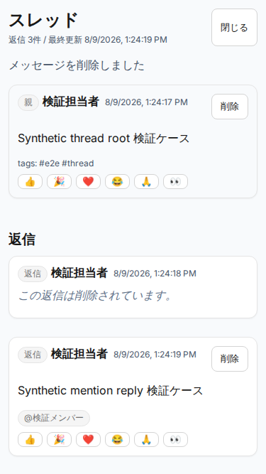

# Issue #2014 Chat thread UI / E2E verification（PR C）

## 対象

- Issue: #2014 `feat(chat): backward-compatible thread and reply foundation`
- Parent: #2003 Workstream 06
- Phase: PR C（frontend thread UI / E2E / manual / evidence）
- Baseline: PR A #2047、PR B #2048 merge後の `origin/main`
- Fixture: synthetic private-group room / root / user / assistantではなく、Chatのroot/reply/mention/ack/reaction/deletionデータのみ

## 実装境界

- 既存 `RoomChat` の親timelineへreply count / last activity / thread open導線を追加。
- thread panelは既存backend APIを使用し、返信pagination、通常返信、確認依頼付き返信、mention、reaction、ack、logical deleteを扱う。
- room timelineにreplyを重複表示しない。
- replyの横断検索結果は親threadへ解決する。
- API responseはallowlist normalizerで再構築し、unknown/provider/internal fieldをstateへ保持しない。
- thread/search/reply responseは期待room・root・relationへbindし、不整合responseをstate/read mutationへ反映しない。
- root timeline、root post、reaction、ack responseも要求room・message・request・root topologyへbindし、不整合な2xx responseをfail closedにする。
- Chat API境界はshared clientの診断Errorを固定文言へ変換し、添付取得失敗はstatusだけを保持する。raw response bodyやrequest pathをbrowser console/E2E logへ複製しない。
- 成功responseのwarningは既知の `POST_WITHOUT_VIEW` codeだけをfrontend所有の固定文言へ変換し、backend由来の任意messageを表示しない。
- logical delete後は本文、tag、mention、reaction、ack、attachmentを表示しない。
- timeline/threadとも、表示済みの最新 `(createdAt, messageId)` だけをroom read boundaryとして送信する。同一ミリ秒に複数messageがある場合はrandom UUIDで内部到着順を推測せず、直前の一意な表示時刻まで保守的に進める。threadに後続pageがある場合は、page境界の同一ミリ秒replyを跨がないよう現在pageの最新時刻も除外する。
- thread replyの確認対象グループはcontrolled stateから`requiredGroupIds`へ接続し、未実装のreply添付操作は表示しない。
- paginationとmutationを相互排他にし、後続pageとmutation refreshの競合による表示欠落を防ぐ。候補comboboxが消費した`Escape`ではpanelを閉じない。
- reply通知deep linkはreturned message IDとtop-level/nested room IDをbindし、reply topologyをallowlist normalizeしてcanonical threadを直接開く。別room遷移では旧room timelineを先に破棄する。ACK relation/candidate responseはroom・message・requestへbindし、ACK previewを含めruntime allowlistと有限上限で再構築してunknown fieldを破棄する。
- non-idempotentなroot message / root確認依頼 / reply POSTは明示的な4xx rejectionだけdraftを保持して再送可能とし、transport failure、5xx、不整合2xxで結果が不明な場合は再送をlockする。root POST成功後の添付または一覧再取得失敗はmessage作成失敗と分離し、draftを消去して再送禁止を案内する。reply POST本文はfresh GETで同一reply IDを確認した場合だけ表示し、51件目以降、refresh failure、同時削除では暫定表示しない。root/replyの`POST_WITHOUT_VIEW`ではthreadとroom timelineを破棄し、後続refresh/read mutationを行わない。
- room selector、room event、別roomのroot deep linkの全経路で旧threadを先に閉じる。thread取得／mutation、reply/ACK reply POST、root POST、attachment upload/download、root timeline上のreaction/ACK/revoke/cancelが403/404になった場合は、current room identityを確認してからthreadとglobal searchを破棄し、無filterのroom再取得でread ACLを確認してtimelineを保持またはpurgeする。対象replyだけの同時削除で再取得が成功した場合は最新threadを維持し、遅延した旧roomのaccess callbackは現在roomへ影響させない。
- root/reply/ACK reply POST lifecycleはApp sessionが所有し、thread panel close/reopenやsection unmount/remount後も送信中／結果不明lockを維持する。chat POST中と結果不明後はroom変更、timeline操作、新規thread openをlockし、requestを開始roomへ固定する。POST待機中にsectionがunmountされた場合はlifecycle結果だけを確定し、添付upload、timeline refresh、read mutationを新たに開始しない。mutation後にthread panelのfocusをclose buttonへ戻さず、root結果案内を独立したlive regionで通知する。
- 同じroomのunread responseもrequest sequenceで順序付け、遅延responseによる巻き戻しを防ぐ。候補0件/loading中の`Escape`でもpanelとdraftを維持する。
- timeline初回／追加page、既読前後のunread取得のいずれで403/404になっても、同じroom ACL再検証へ収束する。再検証失敗時はsummary/provider/model、notification setting、mention/ACK候補・previewもtimelineと同時に破棄し、各request sequenceで遅延responseの復元を拒否する。
- global searchはserverの `(nextBefore, nextBeforeId)` を使い、stale requestをabort/破棄する。rootはparent/rootともnull、replyはparent/rootが同じ非self root IDであるcanonical topologyだけを受理し、欠損・不一致・self-reference・logical deleted resultをfail closedで除外する。
- exact-head独立correctness/security review後、同一roomのACL再検証をsingle-flight化し、並行403/404が互いをabortして誤purgeしないようにした。unread stateをroom-bound化し、room切替またはunread endpointの403/404時に前room／既読更新前の値を消去する。
- Copilot再レビューで、unread endpointの403/404後にroom ACL再検証が成功してもtimeline refreshの呼び出し元へ失敗を返す経路を検出した。再検証結果を返すよう修正し、投稿成功後に誤ったrefresh失敗表示へ遷移しない契約を固定した。
- 独立correctness再レビューで、runtime custom eventだけがself-reference reply topologyを拒否していない経路を検出した。`messageId = parentMessageId = threadRootId`をfail closedで拒否し、thread／timeline取得を開始しないnegative testを追加した。
- logical delete成功直後にglobal search excerptと生成済みsummary/provider/modelを無効化する。通常timeline/thread/deep-linkを含むruntime topologyは旧rootのfield省略互換を維持しつつ、明示的不正型、片側欠損、不一致、self-referenceをfail closedにする。mutation中にfocusable controlが0件となる場合はdialog自体をfallback focus targetにする。

## 自動テスト

未実行項目を成功として扱わない。`release-readiness` はclean checkoutのexact headで実行し、repo-side gateと外部Go依存を区別する。

| 検証                                     | 結果 | 証跡／補足                                                                         |
| ---------------------------------------- | ---- | ---------------------------------------------------------------------------------- |
| focused frontend unit                    | PASS | review remediation 7 files / 186 tests、同一suiteを20回（3,720 tests）反復成功     |
| final Copilot/correctness remediation    | PASS | 2 files / 77 tests、20回（1,540 tests）反復成功                                    |
| frontend full                            | PASS | 95 files / 718 tests                                                               |
| UI core coverage                         | PASS | statements 73.13%、branches 66.19%、functions 72.12%、lines 75.75%（閾値変更なし） |
| frontend build budget                    | PASS | initial JS 517.0 KiB / gzip 158.1 KiB                                              |
| backend full                             | PASS | 2,040 tests                                                                        |
| focused real-backend E2E                 | PASS | `frontend-chat-thread.spec.ts` 1/1（core/full両scopeで成功）                       |
| core E2E                                 | PASS | 107 passed                                                                         |
| full E2E                                 | PASS | 153 passed / 34 expected conditional skips                                         |
| PostgreSQL 15 integration                | PASS | reply pagination、ACL、search、unread、ack、logical delete、raceを含む             |
| old-application compatibility            | PASS | baseline `4b3196a...`、old response/write/data保持                                 |
| OpenAPI export / breaking diff           | PASS | checked-in OpenAPIとの差分なし                                                     |
| bounded-context / docs / image links     | PASS | dependency 0 violation、coverage PASS、130 image links                             |
| audit / secret scan                      | PASS | npm audit high/critical 0、tracked-file secret scan 0（最終標準gateでも再確認）    |
| lint / format / typecheck / build / test | PASS | backend 2,040 / frontend 705、全標準gate成功                                       |
| release-readiness core                   | PASS | clean exact implementation headでrepo-side 29/29、core E2E 107/107                 |

## Real-backend E2E matrix

`packages/frontend/e2e/frontend-chat-thread.spec.ts` はsynthetic fixtureだけで次を検証する。

1. private-group roomと旧互換root messageを作成
2. UIからthreadを開き通常replyを投稿
3. reply count / last activityを更新
4. reply mentionとnotificationを確認し、通知deep linkからcanonical threadを開く
5. 確認依頼付きreplyを投稿してack
6. reply reactionを追加
7. global searchのreply結果からthreadを開く
8. room-level unreadへreplyが反映されることを確認
9. outsider thread accessが404であることを確認
10. replyをlogical deleteし、本文非表示placeholderを確認
11. room root timelineへreplyが重複しないことを確認
12. 候補0件の実`MentionComposer`で`Escape`後もpanelとdraftが残ることを確認
13. 375 x 667 viewportで横overflowがないことを確認し、functional assertion完了後の証跡DOMではsynthetic user/email/run suffixを中立な検証labelへ置換

## Screenshot

スクリーンショットはsynthetic fixtureだけを使用する。functional assertion完了後、証跡取得専用のDOM sanitizationでsynthetic user/email/run suffixも中立な検証labelへ置換し、実ユーザ、実メール、顧客、credential、provider ID/URL、request keyを含めない。

## Security / privacy

- room ACL、project alias、mention/notification/reaction/search/unread/ackのserver契約はPR A/Bの正本を維持する。
- thread mutationと既読更新の403/404は、room ACL再検証が完了するまで操作lockを維持する。room read成功時だけthread再取得へ進み、失敗時はtimeline、thread、global searchを一括purgeする。再検証用のroom取得では既読更新を再帰実行しない。
- unauthorizedとmissingの外部表示を区別しない。
- raw backend error body、parser stack、provider URL/key、unknown response fieldをUIへ表示しない。
- thread mutation成功後の一時的なrefresh failureでは読み込み済みstateを保持し、「再送せず再読み込み」を表示する。ただし403/404を再取得でも確認した場合は権限外本文を保持せずthread stateを破棄し、room readを再検証してtimelineとglobal searchを保持またはpurgeする。
- root/replyとも明示的な4xx rejectionはdraftを保持して修正・再送を許可する。結果不明のnon-idempotent POSTはApp session上のroot/reply composerとroom変更経路をbrowser page reloadまでlockして再送・別room誤送信を防ぎ、fresh GETで確認できないPOST本文を表示しない。root POST成功後の添付／refresh失敗ではdraftを消去し、同じmessageを再送しない固定案内を表示する。
- reply／確認依頼付きreplyは、送信後にsectionがunmountされてもHTTP結果を先に分類する。明示的な4xx rejectionはApp所有lifecycleを`idle`へ戻し、transport／5xx／不整合結果だけを`uncertain`に保つ。
- `POST_WITHOUT_VIEW`受信時はbackend warning本文を破棄し、threadとroom timelineの表示済み本文を消去する。
- logical delete成功時はrefresh成否にかかわらずglobal searchとsummary/provider/modelを消去し、削除済み本文を同一画面の別cacheへ残さない。
- reply notification deep link、ACK response、候補・ACK preview responseはallowlistされたtopology/relation/scalarだけをstateへ反映する。
- attachment upload/downloadの403/404はraw bodyを読まず、global searchを消去してcurrent room read ACLを再検証する。room read成功時だけ最新timelineを保持し、失敗時はroom-bound stateをpurgeする。
- unread stateはroom identityとrequest sequenceへbindし、古いresponseを破棄する。unread endpointが利用不可の場合、room ACL再検証が成功しても旧件数／highlightを表示しない。
- timeline／unread／pagination／summary／ACK preview／通知設定／mention・ACK候補の403/404は同一のroom read ACL再検証へ収束する。失敗時は表示済みsummaryとprovider/model、通知設定、mention/ACK候補・previewを消去し、room切替・`POST_WITHOUT_VIEW`・access purge後に遅延responseを再適用しない。
- global searchのparent/root topologyをallowlist検証し、parent-only、root-only、不一致、self-reference、logical deleted resultと本文をclient stateへ保持しない。
- 後続pageのreaction/ackはmutation responseを対象messageへ局所適用し、先頭page refreshでstale化させない。
- POST後のfresh refreshに同一replyの論理削除が含まれる場合はfresh content-free representationを優先し、POST response本文を再表示しない。
- root削除成功時はrefresh失敗時も親timelineへcontent-freeな削除済み状態を通知する。
- mutation中はclose button、Escape、backdrop closeを無効化し、commit結果の親timeline反映前にpanelを閉じない。操作可能要素が0件になった場合もTab focusをdialog内に保持する。
- panel close/unmount後は完了したmutationから旧threadのrefresh/read副作用を開始しない。
- 同一ミリ秒の表示messageはUUID辞書順を既読high-waterとして使用せず、曖昧な時刻や未取得pageと接する最新時刻を跨いだ既読更新を行わない。
- paginationとmutationは相互排他とし、どちらかのin-flight中に他方のAPI mutation/queryを開始しない。
- 確認対象グループは送信payloadへ接続し、未実装のreply添付pickerを操作可能に見せない。nested comboboxが`Escape`を消費した場合はdraftとpanelを維持する。
- deleted message contentをclient state/renderから除去する。
- 新規dependencyなし。外部API・credential・provider cutoverなし。

## 未実施の実環境範囲

- Sakura VPS、live Quadlet/systemd、production migration、production credential
- Google Drive / Sakura Object Storage
- external LLM / ChatGPT session / X・Threads API

## Rollback

- frontend commitをrevertしてthread panel導線を外す。
- PR A/Bのadditive schema/API/dataは保持する。DB table/column/drop、replyデータ削除、counter再計算は行わない。
- 旧clientは引き続きroot-only timelineを利用できる。
